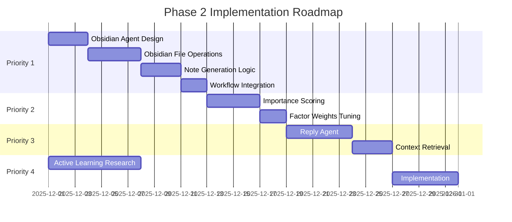

# Gmail Agent Assistant - Next Steps Roadmap

> **Last Updated**: November 2025
> **Phase 1 Status**: Complete (Historical processing finished)
> **Current Focus**: Phase 2 Development

---

## Executive Summary

With Phase 1 complete (464,757 emails processed, 24,679 categorized and labeled), the system is ready for Phase 2 enhancements. The prioritized roadmap below reflects a strategic shift: **Obsidian integration is elevated to high priority** as a context index for multi-agent reasoning, enabling cross-thread context for intelligent email responses.

---

## Completed Work (Phase 1)

| Component | Status | Documentation |
|-----------|--------|---------------|
| GCP Infrastructure | ✅ Complete | [infrastructure/REFERENCE.md](infrastructure/REFERENCE.md) |
| Cloud Tasks Batch Processing | ✅ Complete | [infrastructure/gcp_architecture.md](infrastructure/gcp_architecture.md) |
| Categorization Agent | ✅ Complete | [langgraph_workflow.md](langgraph_workflow.md) |
| Gmail OAuth Integration | ✅ Complete | [src/services/gmail_client.py](src/services/gmail_client.py) |
| CLI Approval Interface | ✅ Complete | [src/cli/approval.py](src/cli/approval.py) |
| Database Schema | ✅ Complete | [data_flow_state.md](data_flow_state.md) |
| Historical Processing | ✅ Complete | 464,757 emails processed |

### Historical Processing Results

```
Emails Processed:     464,757
Emails Categorized:    24,679
Emails Labeled:        24,365
Pending Approval:         314
Error Rate:             0.8%
Total Cost:          $576.30
```

---

## Phase 2: Prioritized Roadmap

### Priority 1: Obsidian Knowledge Base Integration (NEW HIGH PRIORITY)

**Rationale**: Obsidian serves as a **context index for multi-agent reasoning**, not just a knowledge archive. When generating email replies, agents can retrieve relevant context from past conversations, contacts, and topics stored in Obsidian notes.

#### Use Cases

1. **Reply Context Retrieval**: When drafting a reply to an email about "Project Alpha", the Reply Agent queries Obsidian for:
   - Previous emails about Project Alpha
   - Notes on the sender's communication style
   - Related project documentation

2. **Contact Intelligence**: Build sender profiles linking:
   - Communication history
   - Topics discussed
   - Response patterns
   - Relationship context (colleague, client, vendor)

3. **Topic Clustering**: Automatically link related emails via:
   - WikiLinks (`[[Project Alpha]]`, `[[John Smith]]`)
   - Tags (`#urgent`, `#followup`, `#waiting-response`)
   - Backlinks for bidirectional discovery

#### Implementation Plan

```
src/
├── agents/
│   └── obsidian.py          # NEW: Obsidian Agent
├── services/
│   └── obsidian_client.py   # NEW: Obsidian file operations
└── workflows/
    └── email_processor.py   # UPDATE: Add Obsidian node
```

**Database Additions**:
```sql
-- Track Obsidian note paths
ALTER TABLE emails ADD COLUMN obsidian_note_path VARCHAR(500);

-- Index for quick lookups
CREATE INDEX idx_emails_obsidian ON emails(obsidian_note_path) WHERE obsidian_note_path IS NOT NULL;
```

**Note Structure** (per PRD Section 3.7):
```markdown
---
email_id: abc123
message_id: <msg-id@gmail.com>
thread_id: thread-xyz
from: john@company.com
to: [me@gmail.com]
date: 2025-11-28
labels: [Professional/Work]
category: Professional/Work
confidence: 0.92
---

# Subject Line Here

## Summary
AI-generated summary of email content...

## Key Points
- Point 1
- Point 2

## Related
- [[John Smith]] - Sender profile
- [[Project Alpha]] - Related project
- [[Previous Thread]] - Earlier discussion

## Original Content
> Quoted email body...
```

**Reference**: [gmail_inbox_management_system.md](gmail_inbox_management_system.md) Section 3.7 (FR-OBS-001 through FR-OBS-006)

---

### Priority 2: Importance Detection Agent

**Rationale**: Prevents missed critical emails. Multi-factor scoring identifies urgency before categorization routing.

#### Implementation Plan

```python
# src/agents/importance.py

class ImportanceAgent:
    """Multi-factor importance scoring."""

    FACTORS = {
        "sender_authority": 0.25,    # VIP contacts, managers
        "urgency_keywords": 0.20,    # "urgent", "ASAP", "deadline"
        "deadline_detection": 0.20,  # Date/time extraction
        "financial_impact": 0.15,    # Money, contracts, invoices
        "thread_activity": 0.10,     # Multiple replies = important
        "recipient_count": 0.10,     # Direct vs CC'd
    }

    def score(self, email: EmailState) -> ImportanceResult:
        # Returns: critical (>0.9), high (0.7-0.9), normal (0.4-0.7), low (<0.4)
```

**Workflow Integration**:
```
categorize → importance → [calendar | unsubscribe | obsidian]
```

**Reference**: [gmail_inbox_management_system.md](gmail_inbox_management_system.md) Section 3.3 (FR-IMP-001 through FR-IMP-005)

---

### Priority 3: Draft Reply Generation

**Rationale**: Highest user time-savings potential. Leverages Obsidian context for personalized, contextually-aware responses.

#### Context Flow

```
1. User receives email from john@company.com about "Project Alpha"
2. Reply Agent queries Obsidian:
   - [[John Smith]] note → communication style, past interactions
   - [[Project Alpha]] note → project status, key decisions
   - Related thread notes → conversation history
3. Claude Sonnet generates draft with full context
4. Draft saved to Gmail (user reviews before sending)
```

**Implementation**:
```python
# src/agents/reply.py

class ReplyAgent:
    def __init__(self, obsidian_client: ObsidianClient):
        self.obsidian = obsidian_client
        self.model = ChatAnthropic(model="claude-sonnet-4-20250514")

    def generate_draft(self, email: EmailState) -> str:
        # 1. Retrieve context from Obsidian
        sender_profile = self.obsidian.get_contact_note(email.from_email)
        related_notes = self.obsidian.search_related(email.subject, email.body)

        # 2. Build context-rich prompt
        context = self._build_context(sender_profile, related_notes)

        # 3. Generate reply
        return self.model.invoke(self._build_prompt(email, context))
```

**Reference**: [gmail_inbox_management_system.md](gmail_inbox_management_system.md) Section 3.6 (FR-REPLY-001 through FR-REPLY-006)

---

### Priority 4: Active Learning from Feedback

**Rationale**: Improves accuracy over time. Requires research before implementation (see [ACTIVE_LEARNING_RESEARCH.md](ACTIVE_LEARNING_RESEARCH.md)).

#### Current State

- Feedback table exists: [src/models/feedback.py](src/models/feedback.py)
- Records `user_action`, `proposed_category`, `final_category`
- 314 emails pending approval (source of training data)

#### Research Questions

1. What active learning strategy best fits our use case?
2. How to balance exploration vs exploitation?
3. When to retrain vs use few-shot examples?
4. How to handle concept drift over time?

**Reference**: [ACTIVE_LEARNING_RESEARCH.md](ACTIVE_LEARNING_RESEARCH.md) for detailed research prompt

---

### Priority 5: Calendar Event Extraction

**Rationale**: Automates event creation from reservation/meeting emails.

#### Implementation Plan

```python
# src/agents/calendar.py

class CalendarAgent:
    """Extract calendar events from emails."""

    TRIGGERS = ["meeting", "appointment", "reservation", "flight", "hotel", "conference"]

    def extract_event(self, email: EmailState) -> CalendarEvent | None:
        # Returns: title, datetime, duration, location, attendees, virtual_link
```

**Reference**: [gmail_inbox_management_system.md](gmail_inbox_management_system.md) Section 3.5 (FR-CAL-001 through FR-CAL-005)

---

### Priority 6: Unsubscribe Management

**Rationale**: Bulk newsletter cleanup. Lower priority but high user satisfaction.

#### Implementation Plan

```python
# src/agents/unsubscribe.py

class UnsubscribeAgent:
    """Detect and manage unsubscribe options."""

    def detect_unsubscribe(self, email: EmailState) -> UnsubscribeMethod | None:
        # Check: List-Unsubscribe header, mailto links, HTTP links
        # Returns: method (one-click, mailto, http), url/email
```

**Reference**: [gmail_inbox_management_system.md](gmail_inbox_management_system.md) Section 3.4 (FR-UNSUB-001 through FR-UNSUB-005)

---

## Deferred Work

| Feature | Reason | Phase |
|---------|--------|-------|
| Real-time Pub/Sub | Hourly processing sufficient for personal use | Phase 4 |
| Dynamic Category Creation | 8 categories adequate; focus on accuracy first | Phase 3 |
| Redis LLM Caching | Optimize after core features complete | Phase 3 |

---

## Implementation Sequence



---

## File References

### Core Documentation
| File | Purpose |
|------|---------|
| [gmail_inbox_management_system.md](gmail_inbox_management_system.md) | PRD & Technical Specification |
| [README.md](README.md) | Project overview and quick start |
| [CLAUDE.md](CLAUDE.md) | AI assistant development guide |

### Architecture Diagrams
| File | Purpose |
|------|---------|
| [langgraph_workflow.md](langgraph_workflow.md) | LangGraph workflow diagrams |
| [data_flow_state.md](data_flow_state.md) | Data flow and state transitions |
| [categorization_hierarchy.md](categorization_hierarchy.md) | Email category definitions |

### Infrastructure
| File | Purpose |
|------|---------|
| [infrastructure/README.md](infrastructure/README.md) | Infrastructure operations guide |
| [infrastructure/REFERENCE.md](infrastructure/REFERENCE.md) | Complete Terraform resource dictionary |
| [infrastructure/gcp_architecture.md](infrastructure/gcp_architecture.md) | GCP architecture diagram |
| [infrastructure/terraform_deployment.md](infrastructure/terraform_deployment.md) | Deployment sequence |
| [infrastructure/CLAUDE.md](infrastructure/CLAUDE.md) | Infrastructure AI guide |

### Source Code
| File | Purpose |
|------|---------|
| [src/main.py](src/main.py) | FastAPI application |
| [src/config.py](src/config.py) | Configuration and categories |
| [src/agents/categorization.py](src/agents/categorization.py) | Categorization agent |
| [src/services/anthropic_client.py](src/services/anthropic_client.py) | Claude API client |
| [src/services/gmail_client.py](src/services/gmail_client.py) | Gmail API client |
| [src/workflows/email_processor.py](src/workflows/email_processor.py) | LangGraph workflow |
| [src/models/email.py](src/models/email.py) | Email database model |
| [src/models/feedback.py](src/models/feedback.py) | Feedback model for active learning |

---

## Success Metrics (Phase 2)

| Metric | Target | Measurement |
|--------|--------|-------------|
| Importance Detection | <5% false negatives | Track missed urgent emails |
| Reply Draft Acceptance | 80% with minor edits | User feedback on drafts |
| Obsidian Note Quality | Useful for context retrieval | Manual review of generated notes |
| Active Learning | 5% accuracy improvement/month | Compare monthly categorization accuracy |

---

## Next Actions

1. **Immediate**: Review 314 pending approvals via CLI to generate training data
2. **This Week**: Design Obsidian note schema and file structure
3. **Research**: Complete active learning research (see [ACTIVE_LEARNING_RESEARCH.md](ACTIVE_LEARNING_RESEARCH.md))
4. **Development**: Begin Obsidian agent implementation
