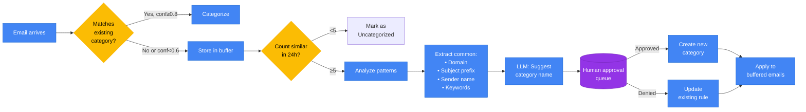

# Email Categorization Hierarchy

```mermaid
graph TD
    ROOT[Email Categorization Engine]

    subgraph Special["⚠️ Priority Override"]
        IMP{Important<br/>Score >0.9?}
        IMP_CAT[🚨 Important<br/>Keywords: urgent, deadline, interview,<br/>offer, critical, action required,<br/>ASAP, time-sensitive]
    end

    subgraph Personal["👤 Personal"]
        PERS[Personal]
        PERS_FRIENDS[Friends<br/>• Tone: informal, casual<br/>• Domains: gmail.com, yahoo.com,<br/>  hotmail.com<br/>• Keywords: hey, what's up, hangout,<br/>  weekend plans, catch up]
        PERS_FAMILY[Family<br/>• Names: Mom, Dad, Sister, etc.<br/>• Keywords: family reunion, holiday,<br/>  birthday, anniversary<br/>• Domains: known family emails]
    end

    subgraph Professional["💼 Professional"]
        PROF[Professional]
        PROF_RECRUIT[Recruiters<br/>• Domains: linkedin.com, greenhouse.io,<br/>  lever.co, *recruiter*<br/>• Titles: HR, Talent Acquisition,<br/>  Recruitment Specialist<br/>• Keywords: opportunity, position,<br/>  interview, role, hiring, candidate]
        PROF_SCHOOL[School<br/>• Domains: *.edu<br/>• Keywords: course, lecture, assignment,<br/>  syllabus, grade, professor, canvas,<br/>  blackboard, semester<br/>• From: registrar, dean, faculty]
    end

    subgraph Purchases["🛒 Purchases"]
        PURCH[Purchases]
        PURCH_AMZN[Amazon<br/>• Domains: amazon.com, amazon.co.*<br/>• Keywords: order confirmation,<br/>  shipped, tracking, delivery,<br/>  Your Amazon.com order<br/>• Pattern: Order #\d{3}-\d{7}-\d{7}]
        PURCH_ETSY[Etsy<br/>• Domains: etsy.com, transaction@etsy.com<br/>• Keywords: handmade, shop, seller,<br/>  purchase from, review your order<br/>• Pattern: Order #\d{10}]
        PURCH_OTHER[Other Purchases<br/>• Keywords: shopping cart, receipt,<br/>  invoice, payment confirmation,<br/>  order summary<br/>• Pattern: Total: \$, Order #]
    end

    subgraph Reservations["✈️ Reservations"]
        RESV[Reservations]
        RESV_HOTEL[Hotels<br/>• Domains: booking.com, hotels.com,<br/>  expedia.com, airbnb.com<br/>• Keywords: reservation, confirmation,<br/>  check-in, check-out, booking<br/>• Pattern: Confirmation #[A-Z0-9]{6,12}]
        RESV_REST[Restaurants<br/>• Domains: opentable.com, resy.com,<br/>  yelp.com<br/>• Keywords: reservation confirmed,<br/>  table for, party of, dining time<br/>• Pattern: \d{1,2}:\d{2} [AP]M]
        RESV_TRAVEL[Travel<br/>• Domains: airline.com, united.com,<br/>  delta.com, southwest.com<br/>• Keywords: flight, boarding pass,<br/>  gate, seat, baggage<br/>• Pattern: Flight [A-Z]{2}\d{3,4}]
    end

    subgraph Newsletters["📰 Newsletters"]
        NEWS[Newsletters]
        NEWS_SUB[Substacks<br/>• Domains: substack.com<br/>• Pattern: .*@substack.com<br/>• Keywords: newsletter, subscribe,<br/>  unsubscribe, latest issue]
        NEWS_NEWS[News<br/>• Domains: wsj.com, nytimes.com,<br/>  washingtonpost.com, bloomberg.com<br/>• Keywords: breaking news, daily briefing,<br/>  top stories, edition]
        NEWS_MKTG[Marketing<br/>• Headers: List-Unsubscribe present<br/>• Keywords: unsubscribe, promotional,<br/>  deals, sale, limited time<br/>• Bulk-Sender: Precedence: bulk]
    end

    subgraph Dynamic["🔄 Dynamic Categories"]
        DYN_TRIGGER{Trigger?}
        DYN_NEW[Create New Category<br/>• 5+ emails with confidence <0.6<br/>  from same domain in 24h<br/>• 10+ emails with similar subjects<br/>  not matching taxonomy<br/>• User manually creates new folder]
        DYN_SUGGEST[AI Suggestion<br/>• Analyze common patterns<br/>• Propose category name<br/>• Queue for user approval]
    end

    ROOT --> IMP
    IMP -->|Yes| IMP_CAT
    IMP -->|No| PERS
    IMP -->|No| PROF
    IMP -->|No| PURCH
    IMP -->|No| RESV
    IMP -->|No| NEWS

    PERS --> PERS_FRIENDS
    PERS --> PERS_FAMILY

    PROF --> PROF_RECRUIT
    PROF --> PROF_SCHOOL

    PURCH --> PURCH_AMZN
    PURCH --> PURCH_ETSY
    PURCH --> PURCH_OTHER

    RESV --> RESV_HOTEL
    RESV --> RESV_REST
    RESV --> RESV_TRAVEL

    NEWS --> NEWS_SUB
    NEWS --> NEWS_NEWS
    NEWS --> NEWS_MKTG

    ROOT -.->|"Confidence <0.6<br/>Volume >5/24h"| DYN_TRIGGER
    DYN_TRIGGER -->|Yes| DYN_NEW
    DYN_NEW --> DYN_SUGGEST

    classDef root fill:#4285F4,stroke:#1967D2,color:#fff,font-weight:bold
    classDef category fill:#34A853,stroke:#1E8E3E,color:#fff,font-weight:bold
    classDef subcategory fill:#FBBC04,stroke:#F9AB00,color:#000
    classDef important fill:#EA4335,stroke:#C5221F,color:#fff,font-weight:bold
    classDef dynamic fill:#9334E6,stroke:#7627BB,color:#fff
    classDef decision fill:#FF6D01,stroke:#E65100,color:#fff

    class ROOT root
    class PERS,PROF,PURCH,RESV,NEWS category
    class PERS_FRIENDS,PERS_FAMILY,PROF_RECRUIT,PROF_SCHOOL,PURCH_AMZN,PURCH_ETSY,PURCH_OTHER,RESV_HOTEL,RESV_REST,RESV_TRAVEL,NEWS_SUB,NEWS_NEWS,NEWS_MKTG subcategory
    class IMP_CAT important
    class DYN_NEW,DYN_SUGGEST dynamic
    class IMP,DYN_TRIGGER decision
```

## Classification Algorithm

```python
from typing import Literal, Optional
from dataclasses import dataclass
import re

@dataclass
class ClassificationRule:
    category: str
    confidence: float
    reasoning: str

class EmailCategorizer:
    def __init__(self):
        self.category_rules = self._load_rules()
        self.dynamic_categories = []

    def categorize(self, email: dict) -> ClassificationRule:
        # Step 1: Check importance override
        importance_score = self.calculate_importance(email)
        if importance_score > 0.9:
            return ClassificationRule(
                category="Important",
                confidence=importance_score,
                reasoning="High importance score triggers override"
            )

        # Step 2: Evaluate all categories
        scores = []

        # Personal
        if self._match_personal_friends(email):
            scores.append(("Personal/Friends", 0.85, "Informal tone + personal domain"))
        if self._match_personal_family(email):
            scores.append(("Personal/Family", 0.90, "Known family member"))

        # Professional
        if self._match_professional_recruiters(email):
            scores.append(("Professional/Recruiters", 0.88, "Recruiter domain + job keywords"))
        if self._match_professional_school(email):
            scores.append(("Professional/School", 0.95, ".edu domain"))

        # Purchases
        if self._match_purchases_amazon(email):
            scores.append(("Purchases/Amazon", 0.92, "Amazon domain + order number"))
        if self._match_purchases_etsy(email):
            scores.append(("Purchases/Etsy", 0.90, "Etsy transaction"))
        if self._match_purchases_other(email):
            scores.append(("Purchases/Other", 0.75, "Order/receipt keywords"))

        # Reservations
        if self._match_reservations_hotels(email):
            scores.append(("Reservations/Hotels", 0.88, "Booking confirmation"))
        if self._match_reservations_restaurants(email):
            scores.append(("Reservations/Restaurants", 0.85, "Restaurant reservation"))
        if self._match_reservations_travel(email):
            scores.append(("Reservations/Travel", 0.90, "Flight confirmation"))

        # Newsletters
        if self._match_newsletters_substacks(email):
            scores.append(("Newsletters/Substacks", 0.95, "Substack domain"))
        if self._match_newsletters_news(email):
            scores.append(("Newsletters/News", 0.90, "News publication"))
        if self._match_newsletters_marketing(email):
            scores.append(("Newsletters/Marketing", 0.80, "Bulk sender + unsubscribe"))

        # Step 3: Select best match
        if not scores:
            return self._trigger_dynamic_category(email)

        category, confidence, reasoning = max(scores, key=lambda x: x[1])
        return ClassificationRule(category, confidence, reasoning)

    def _match_professional_recruiters(self, email: dict) -> bool:
        recruiter_domains = ['linkedin.com', 'greenhouse.io', 'lever.co']
        recruiter_keywords = ['opportunity', 'position', 'interview', 'role', 'hiring', 'candidate']
        recruiter_titles = ['recruiter', 'talent acquisition', 'hr specialist']

        domain_match = any(d in email['from_email'].lower() for d in recruiter_domains)
        keyword_match = any(k in email['body'].lower() for k in recruiter_keywords)
        title_match = any(t in email['from_email'].lower() for t in recruiter_titles)

        return domain_match or (keyword_match and title_match)

    def _match_purchases_amazon(self, email: dict) -> bool:
        amazon_pattern = r'Order #\d{3}-\d{7}-\d{7}'
        amazon_domain = 'amazon.com' in email['from_email'].lower()
        order_match = re.search(amazon_pattern, email['body'])

        return amazon_domain and order_match

    def _match_reservations_travel(self, email: dict) -> bool:
        flight_pattern = r'Flight [A-Z]{2}\d{3,4}'
        airline_keywords = ['boarding pass', 'gate', 'seat', 'baggage', 'departure']

        flight_match = re.search(flight_pattern, email['body'])
        keyword_match = any(k in email['body'].lower() for k in airline_keywords)

        return flight_match or keyword_match

    def _trigger_dynamic_category(self, email: dict) -> ClassificationRule:
        # Check if similar emails exist
        similar_count = self._count_recent_similar(email, hours=24)

        if similar_count >= 5:
            suggested_name = self._suggest_category_name(email)
            return ClassificationRule(
                category=f"Dynamic/{suggested_name}",
                confidence=0.50,
                reasoning=f"New pattern detected: {similar_count} similar emails"
            )

        return ClassificationRule(
            category="Uncategorized",
            confidence=0.30,
            reasoning="No matching category"
        )
```

## Pattern Matching Examples

| Category | Example Email | Matched Rule | Confidence |
|----------|---------------|--------------|------------|
| Professional/Recruiters | "Exciting Senior Engineer opportunity at TechCorp" from talent@greenhouse.io | Domain: greenhouse.io + Keywords: opportunity, engineer | 0.92 |
| Purchases/Amazon | "Your Amazon.com order #123-4567890-1234567 has shipped" | Domain: amazon.com + Pattern: Order #123-... | 0.95 |
| Reservations/Hotels | "Booking confirmation #ABC123XYZ for Hilton San Francisco, Check-in: 12/25" | Keywords: confirmation, check-in + Pattern: #ABC123XYZ | 0.88 |
| Newsletters/Substacks | From: newsletter@example.substack.com | Domain: substack.com | 0.98 |
| Important | "URGENT: Interview scheduled for tomorrow 9am" | Keywords: urgent, interview + Deadline detected | 0.95 |

## Dynamic Category Creation Workflow



## Confidence Scoring Formula

```
Confidence = Σ(factor_weight × factor_match)

Factors by Category:

Professional/Recruiters:
- Domain match (0.40): greenhouse.io, lever.co, linkedin.com
- Keyword match (0.30): opportunity, position, interview
- Title match (0.20): recruiter, HR, talent
- Pattern match (0.10): "We're hiring", "join our team"

Purchases/Amazon:
- Domain match (0.50): amazon.com
- Pattern match (0.40): Order #\d{3}-\d{7}-\d{7}
- Keyword match (0.10): shipped, delivery, tracking

Newsletters/Marketing:
- Header match (0.50): List-Unsubscribe present
- Bulk sender (0.30): Precedence: bulk
- Keyword match (0.20): unsubscribe, promotional

Threshold for auto-apply: 0.80
Threshold for human review: 0.60-0.80
Below 0.60: Consider new category
```
