# Email Categorization Hierarchy

This document describes the email categorization system. **Phase 1 categorization and Phase 2 importance/specialized agents are implemented.**

## Phase 1: Current Categories

The following 8 categories are implemented in `src/config.py`:

```mermaid
graph TD
    ROOT[Email Categorization<br/>Claude Haiku → Sonnet Escalation]

    subgraph Categories["📧 Phase 1 Categories"]
        IMP[🚨 Important<br/>Time-sensitive, critical emails]
        PERS_F[👤 Personal/Friends<br/>Informal tone, personal domains]
        PERS_FAM[👨‍👩‍👧 Personal/Family<br/>Family members]
        PROF_R[💼 Professional/Recruiters<br/>Job-related emails]
        PROF_W[🏢 Professional/Work<br/>Work correspondence]
        PURCH[🛒 Purchases/Orders<br/>Orders, shipping]
        NEWS[📰 Newsletters/Subscriptions<br/>Newsletter emails]
        MKTG[📢 Marketing/Promotions<br/>Promotional emails]
    end

    subgraph Routing["🔀 Confidence Routing"]
        HIGH{Confidence<br/>≥0.8?}
        LABEL[✅ Auto-label<br/>Agent/{Category}]
        QUEUE[⏳ Human Review<br/>Pending Approval]
    end

    ROOT --> IMP
    ROOT --> PERS_F
    ROOT --> PERS_FAM
    ROOT --> PROF_R
    ROOT --> PROF_W
    ROOT --> PURCH
    ROOT --> NEWS
    ROOT --> MKTG

    IMP --> HIGH
    PERS_F --> HIGH
    PERS_FAM --> HIGH
    PROF_R --> HIGH
    PROF_W --> HIGH
    PURCH --> HIGH
    NEWS --> HIGH
    MKTG --> HIGH

    HIGH -->|Yes| LABEL
    HIGH -->|No| QUEUE

    classDef root fill:#4285F4,stroke:#1967D2,color:#fff,font-weight:bold
    classDef category fill:#34A853,stroke:#1E8E3E,color:#fff
    classDef decision fill:#FBBC04,stroke:#F9AB00,color:#000
    classDef output fill:#9334E6,stroke:#7627BB,color:#fff

    class ROOT root
    class IMP,PERS_F,PERS_FAM,PROF_R,PROF_W,PURCH,NEWS,MKTG category
    class HIGH decision
    class LABEL,QUEUE output
```

## Category Definitions (from src/config.py)

| Category | Description | Keywords/Domains |
|----------|-------------|------------------|
| **Important** | Time-sensitive or critical emails | `urgent`, `deadline`, `interview`, `offer`, `critical`, `action required`, `ASAP` |
| **Personal/Friends** | Emails from friends | Domains: `gmail.com`, `yahoo.com`, `hotmail.com`, `outlook.com` |
| **Personal/Family** | Emails from family members | `family`, `mom`, `dad`, `sister`, `brother`, `reunion` |
| **Professional/Recruiters** | Job-related emails | Domains: `linkedin.com`, `greenhouse.io`, `lever.co`; Keywords: `opportunity`, `position`, `interview`, `role`, `hiring`, `candidate` |
| **Professional/Work** | Work correspondence | `meeting`, `project`, `deadline`, `deliverable`, `report` |
| **Purchases/Orders** | Order confirmations, shipping | Domains: `amazon.com`, `etsy.com`, `ebay.com`, `shopify.com`; Keywords: `order`, `shipped`, `delivery`, `tracking`, `receipt` |
| **Newsletters/Subscriptions** | Newsletter emails | Domains: `substack.com`; Keywords: `unsubscribe`, `newsletter`, `digest`, `weekly` |
| **Marketing/Promotions** | Promotional emails | `sale`, `discount`, `promo`, `offer`, `deal`, `limited time` |

## Code Reference

```python
# src/config.py:108-144

CATEGORIES = {
    "Important": {
        "description": "Time-sensitive or critical emails requiring immediate attention",
        "keywords": ["urgent", "deadline", "interview", "offer", "critical", "action required", "ASAP"],
    },
    "Personal/Friends": {
        "description": "Emails from friends with informal tone",
        "domains": ["gmail.com", "yahoo.com", "hotmail.com", "outlook.com"],
    },
    "Personal/Family": {
        "description": "Emails from family members",
        "keywords": ["family", "mom", "dad", "sister", "brother", "reunion"],
    },
    "Professional/Recruiters": {
        "description": "Job-related emails from recruiters",
        "domains": ["linkedin.com", "greenhouse.io", "lever.co"],
        "keywords": ["opportunity", "position", "interview", "role", "hiring", "candidate"],
    },
    "Professional/Work": {
        "description": "Work-related professional correspondence",
        "keywords": ["meeting", "project", "deadline", "deliverable", "report"],
    },
    "Purchases/Orders": {
        "description": "Order confirmations and shipping notifications",
        "domains": ["amazon.com", "etsy.com", "ebay.com", "shopify.com"],
        "keywords": ["order", "shipped", "delivery", "tracking", "receipt"],
    },
    "Newsletters/Subscriptions": {
        "description": "Newsletter and subscription emails",
        "domains": ["substack.com"],
        "keywords": ["unsubscribe", "newsletter", "digest", "weekly"],
    },
    "Marketing/Promotions": {
        "description": "Promotional and marketing emails",
        "keywords": ["sale", "discount", "promo", "offer", "deal", "limited time"],
    },
}
```

## Classification Algorithm (Phase 1)

The actual implementation uses Claude LLM for classification, not rule-based matching:

```python
# src/services/anthropic_client.py:61-167

def classify_email(self, subject, from_email, body, categories, use_quality_model=False):
    """Classify an email into a category using Claude."""
    model = self.config.quality_model if use_quality_model else self.config.fast_model

    system_prompt = """You are an expert email classifier...
    Respond with JSON: {"category": "...", "confidence": 0.0-1.0, "reasoning": "...", "key_phrases": [...]}
    """

    response = self.client.messages.create(
        model=model,  # claude-3-haiku or claude-sonnet-4
        max_tokens=500,
        messages=[{"role": "user", "content": user_prompt}],
        system=system_prompt,
    )

    return ClassificationResult(
        category=result["category"],
        confidence=float(result["confidence"]),
        reasoning=result["reasoning"],
        ...
    )
```

### Escalation Strategy

```python
# src/services/anthropic_client.py:173-219

def classify_with_escalation(self, subject, from_email, body, categories, confidence_threshold=0.7):
    """First try Haiku, escalate to Sonnet if confidence < 0.7"""

    # Fast model first
    result = self.classify_email(..., use_quality_model=False)

    # Escalate if low confidence
    if result.confidence < confidence_threshold:
        result = self.classify_email(..., use_quality_model=True)

    return result
```

## Confidence Thresholds

| Threshold | Action |
|-----------|--------|
| ≥ 0.8 | Auto-apply Gmail label |
| 0.7 - 0.8 | Auto-apply, but may need review |
| < 0.7 | Escalate to Claude Sonnet |
| < 0.8 (after escalation) | Queue for human approval |

## Example Classifications

| Email | Category | Confidence | Reasoning |
|-------|----------|------------|-----------|
| "Exciting Senior Engineer opportunity" from talent@greenhouse.io | Professional/Recruiters | 0.92 | Recruiter domain + job keywords |
| "Your Amazon order has shipped" | Purchases/Orders | 0.95 | Amazon domain + order keywords |
| "URGENT: Interview tomorrow 9am" | Important | 0.95 | Urgent keyword + interview |
| Newsletter from @substack.com | Newsletters/Subscriptions | 0.98 | Substack domain |
| "50% off sale today only!" | Marketing/Promotions | 0.88 | Promotional keywords |

---

## Phase 2: Importance Scoring (Implemented)

After categorization, the Importance Agent scores each email using 6 weighted factors:

```mermaid
graph TD
    subgraph ImportanceScoring["📊 Phase 2: Importance Scoring"]
        EMAIL[Categorized Email] --> IMP_AGENT[Importance Agent<br/>Claude Haiku]

        IMP_AGENT --> FACTORS[6-Factor Analysis]

        FACTORS --> F1["Sender Authority (0.25)<br/>VIP list matching"]
        FACTORS --> F2["Urgency Keywords (0.20)<br/>urgent, ASAP, deadline"]
        FACTORS --> F3["Deadline Detection (0.20)<br/>Date/time patterns"]
        FACTORS --> F4["Financial Signals (0.15)<br/>invoice, payment, $$$"]
        FACTORS --> F5["Thread Activity (0.10)<br/>Gmail thread count"]
        FACTORS --> F6["Recipient Position (0.10)<br/>TO vs CC"]

        F1 --> SCORE[Weighted Score<br/>0.0 - 1.0]
        F2 --> SCORE
        F3 --> SCORE
        F4 --> SCORE
        F5 --> SCORE
        F6 --> SCORE

        SCORE --> LEVEL{Score Level}
        LEVEL -->|"≥0.9"| CRITICAL[🚨 Critical]
        LEVEL -->|"0.7-0.9"| HIGH[⚠️ High]
        LEVEL -->|"0.4-0.7"| NORMAL[📧 Normal]
        LEVEL -->|"<0.4"| LOW[📭 Low]
    end

    classDef agent fill:#4285F4,stroke:#1967D2,color:#fff
    classDef factor fill:#34A853,stroke:#1E8E3E,color:#fff
    classDef level fill:#FBBC04,stroke:#F9AB00,color:#000
    classDef critical fill:#EA4335,stroke:#C5221F,color:#fff
    classDef high fill:#FF6D01,stroke:#E65100,color:#fff

    class IMP_AGENT agent
    class F1,F2,F3,F4,F5,F6,SCORE factor
    class LEVEL level
    class CRITICAL critical
    class HIGH high
```



### Importance Labels Applied

| Level | Score Range | Gmail Label | Action |
|-------|-------------|-------------|--------|
| Critical | ≥ 0.9 | `Agent/Priority/Critical` | Immediate attention |
| High | 0.7 - 0.9 | `Agent/Priority/High` | Prioritize today |
| Normal | 0.4 - 0.7 | (none) | Standard processing |
| Low | < 0.4 | (none) | FYI only |

### Code Reference

```python
# src/agents/importance.py:89-156
FACTOR_WEIGHTS = {
    "sender_authority": 0.25,
    "urgency_keywords": 0.20,
    "deadline_detection": 0.20,
    "financial_signals": 0.15,
    "thread_activity": 0.10,
    "recipient_position": 0.10,
}
```

---

## Phase 2: Specialized Agents (Implemented)

### Calendar Agent

Extracts calendar events from meeting/reservation emails:


### Unsubscribe Agent

Detects unsubscribe options for newsletters/marketing:


---

## Phase 3+: Future Enhancements

### Dynamic Category Creation (Planned)


### Feedback-Based Learning (Planned)

When users correct categories, the system will learn:
- Common correction patterns
- New keywords for categories
- Domain-to-category mappings
