# Data Flow & State Management

```mermaid
flowchart TB
    subgraph Source["📧 Source: Gmail API"]
        GMAIL_INBOX[(Gmail Inbox<br/>State: unread)]
        GMAIL_LIST[Batch Fetch<br/>maxResults: 100]
        GMAIL_GET[Get Full Message<br/>format: full]
    end

    subgraph Processing["⚙️ Processing Pipeline"]
        IDEM{Idempotency Check<br/>message_id exists?}
        FETCH_STATE[State: fetched<br/>✓ Checkpoint saved]

        CAT_AGENT[Categorization Agent]
        CAT_CACHE{Cache hit?}
        CAT_LLM[LLM Call<br/>Claude Haiku]
        CAT_STATE[State: categorized<br/>✓ Checkpoint saved<br/>+ confidence<br/>+ reasoning]

        IMP_AGENT[Importance Agent]
        IMP_STATE[State: importance_checked<br/>✓ Checkpoint saved<br/>+ importance_level<br/>+ action_items]

        CAL_AGENT[Calendar Agent]
        CAL_STATE[State: calendar_extracted<br/>✓ Checkpoint saved<br/>+ event_details]

        OBS_AGENT[Obsidian Agent]
        OBS_STATE[State: note_created<br/>✓ Checkpoint saved<br/>+ note_path]

        APPROVAL{Needs<br/>approval?}
        LABEL_STATE[State: labeled<br/>✓ Transaction commit]
        COMPLETE_STATE[State: completed<br/>✓ Final checkpoint]
    end

    subgraph PostgreSQL["🗄️ PostgreSQL Database"]
        direction TB

        TBL_EMAILS[(emails table<br/>PK: email_id<br/>UNIQUE: message_id<br/>status: processing)]

        TBL_CHECKPOINTS[(checkpoints table<br/>FK: email_id<br/>step: varchar<br/>state_json: jsonb)]

        TBL_FEEDBACK[(feedback table<br/>FK: email_id<br/>user_action: approved/denied<br/>proposed vs final)]

        TBL_RULES[(importance_rules table<br/>pattern: text<br/>approved: boolean)]

        TBL_UNSUB[(unsubscribe_queue table<br/>status: pending/approved/executed)]
    end

    subgraph Redis["⚡ Redis Cache"]
        CACHE_LLM[(LLM Response Cache<br/>TTL: 86400s<br/>Key: md5(prompt+model))]
    end

    subgraph Filesystem["💾 Local Filesystem"]
        OBSIDIAN[(Obsidian Vault<br/>inbox/*.md<br/>YAML frontmatter)]
    end

    subgraph Archive["☁️ Cloud Storage"]
        GCS_LOGS[(Archived Logs<br/>gs://bucket/logs/)]
        GCS_BACKUP[(Email Backups<br/>gs://bucket/backups/)]
    end

    subgraph HumanLoop["👤 Human Approval"]
        APPROVAL_UI[CLI Approval Interface]
        APPROVAL_QUEUE[(Approval Queue<br/>State: pending)]
        FEEDBACK_LOOP[Record Feedback]
    end

    %% Main Flow
    GMAIL_INBOX --> GMAIL_LIST
    GMAIL_LIST --> GMAIL_GET
    GMAIL_GET --> IDEM

    %% Idempotency Check
    IDEM -->|"Exists<br/>(idempotent)"| COMPLETE_STATE
    IDEM -->|"New"| TBL_EMAILS
    TBL_EMAILS -->|"INSERT<br/>RETURNING id"| FETCH_STATE
    FETCH_STATE -->|"INSERT checkpoint"| TBL_CHECKPOINTS

    %% Categorization with Caching
    FETCH_STATE --> CAT_AGENT
    CAT_AGENT --> CAT_CACHE
    CAT_CACHE -->|"Hit"| CAT_STATE
    CAT_CACHE -->|"Miss"| CAT_LLM
    CAT_LLM -->|"Cache SET<br/>TTL: 24h"| CACHE_LLM
    CAT_LLM --> CAT_STATE
    CAT_STATE -->|"UPDATE emails<br/>SET category, confidence<br/>INSERT checkpoint"| TBL_EMAILS
    CAT_STATE --> TBL_CHECKPOINTS

    %% Importance Detection
    CAT_STATE --> IMP_AGENT
    IMP_AGENT -->|"SELECT * FROM<br/>importance_rules"| TBL_RULES
    IMP_AGENT --> IMP_STATE
    IMP_STATE -->|"UPDATE emails<br/>SET importance_level<br/>INSERT checkpoint"| TBL_EMAILS
    IMP_STATE --> TBL_CHECKPOINTS

    %% Calendar Extraction
    IMP_STATE --> CAL_AGENT
    CAL_AGENT --> CAL_STATE
    CAL_STATE -->|"INSERT checkpoint"| TBL_CHECKPOINTS

    %% Obsidian Note Creation
    CAL_STATE --> OBS_AGENT
    OBS_AGENT -->|"Write markdown<br/>with YAML frontmatter"| OBSIDIAN
    OBS_AGENT --> OBS_STATE
    OBS_STATE -->|"INSERT checkpoint"| TBL_CHECKPOINTS

    %% Approval Decision
    OBS_STATE --> APPROVAL
    APPROVAL -->|"confidence ≥0.8"| LABEL_STATE
    APPROVAL -->|"confidence <0.8"| APPROVAL_QUEUE

    %% Human Approval Loop
    APPROVAL_QUEUE -->|"Batch SELECT<br/>WHERE status=pending"| APPROVAL_UI
    APPROVAL_UI -->|"Approve/Deny"| FEEDBACK_LOOP
    FEEDBACK_LOOP -->|"INSERT feedback<br/>UPDATE emails"| TBL_FEEDBACK
    FEEDBACK_LOOP --> LABEL_STATE

    %% Labeling (Transaction)
    LABEL_STATE -->|"BEGIN TRANSACTION<br/>UPDATE emails SET status=labeled<br/>COMMIT"| TBL_EMAILS
    LABEL_STATE -->|"Apply label via API"| GMAIL_INBOX

    %% Completion
    LABEL_STATE --> COMPLETE_STATE
    COMPLETE_STATE -->|"UPDATE emails<br/>SET status=completed"| TBL_EMAILS
    COMPLETE_STATE -->|"Final checkpoint"| TBL_CHECKPOINTS

    %% Archival
    COMPLETE_STATE -.->|"Daily backup"| GCS_BACKUP
    TBL_EMAILS -.->|"Stream logs"| GCS_LOGS

    %% Unsubscribe Flow (parallel)
    IMP_STATE -.->|"If List-Unsubscribe<br/>header present"| TBL_UNSUB
    TBL_UNSUB -.->|"Batch approval"| APPROVAL_UI

    %% Feedback Training Loop
    TBL_FEEDBACK -.->|"Retrain rules<br/>(weekly batch)"| TBL_RULES

    classDef source fill:#4285F4,stroke:#1967D2,color:#fff
    classDef process fill:#34A853,stroke:#1E8E3E,color:#fff
    classDef db fill:#FBBC04,stroke:#F9AB00,color:#000
    classDef cache fill:#FF6D01,stroke:#E65100,color:#fff
    classDef storage fill:#9334E6,stroke:#7627BB,color:#fff
    classDef human fill:#EA4335,stroke:#C5221F,color:#fff
    classDef state fill:#00ACC1,stroke:#00838F,color:#fff
    classDef decision fill:#7CB342,stroke:#558B2F,color:#fff

    class GMAIL_INBOX,GMAIL_LIST,GMAIL_GET source
    class CAT_AGENT,IMP_AGENT,CAL_AGENT,OBS_AGENT process
    class TBL_EMAILS,TBL_CHECKPOINTS,TBL_FEEDBACK,TBL_RULES,TBL_UNSUB db
    class CACHE_LLM cache
    class OBSIDIAN,GCS_LOGS,GCS_BACKUP storage
    class APPROVAL_UI,APPROVAL_QUEUE,FEEDBACK_LOOP human
    class FETCH_STATE,CAT_STATE,IMP_STATE,CAL_STATE,OBS_STATE,LABEL_STATE,COMPLETE_STATE state
    class IDEM,APPROVAL,CAT_CACHE decision
```

## Email State Transitions

```mermaid
stateDiagram-v2
    [*] --> unread: Email arrives in Gmail
    unread --> fetched: Batch fetch API call
    fetched --> processing: Idempotency check passes
    processing --> categorized: Category assigned
    categorized --> importance_checked: Importance scored
    importance_checked --> enriched: Calendar/Obsidian added
    enriched --> pending_approval: confidence < 0.8
    enriched --> labeled: confidence ≥ 0.8
    pending_approval --> labeled: User approves
    pending_approval --> categorized: User denies (retry)
    labeled --> completed: Final checkpoint saved
    completed --> [*]

    processing --> failed: Error occurred
    failed --> processing: Retry (3x max)
    failed --> dead_letter: Max retries exceeded
```



## Checkpoint Recovery Example

```sql
-- Recovery query after crash
SELECT
    e.email_id,
    e.status,
    c.step AS last_completed_step,
    c.state_json
FROM emails e
LEFT JOIN LATERAL (
    SELECT step, state_json, created_at
    FROM checkpoints
    WHERE email_id = e.email_id
    ORDER BY created_at DESC
    LIMIT 1
) c ON true
WHERE e.status != 'completed'
ORDER BY e.date DESC;

-- Resume from last checkpoint
-- If last step = 'categorized', start from importance_agent
-- If last step = 'importance_checked', start from calendar_agent
```

## Transaction Boundaries

| Operation | Transaction Scope | Rollback Strategy |
|-----------|-------------------|-------------------|
| Email fetch | Single INSERT | Skip on duplicate message_id |
| Agent processing | UPDATE + INSERT checkpoint | Rollback both on error |
| Human approval | UPDATE email + INSERT feedback | Atomic transaction |
| Gmail labeling | External API + UPDATE status | Compensating transaction |
| Batch operations | Savepoints per email | Rollback individual, continue batch |

### Example Transaction

```python
from sqlalchemy import create_engine
from sqlalchemy.orm import sessionmaker

def process_email_with_transaction(email_id: str):
    session = Session()

    try:
        # Start transaction
        session.begin()

        # Step 1: Update email status
        email = session.query(Email).filter_by(email_id=email_id).one()
        email.status = 'processing'

        # Step 2: Run categorization
        result = categorization_agent(email)
        email.category = result['category']
        email.confidence = result['confidence']

        # Step 3: Save checkpoint
        checkpoint = Checkpoint(
            email_id=email_id,
            step='categorized',
            state_json=result
        )
        session.add(checkpoint)

        # Commit all or nothing
        session.commit()

    except Exception as e:
        # Rollback on any error
        session.rollback()
        logger.error(f"Transaction failed for {email_id}: {e}")
        raise
    finally:
        session.close()
```

## Write Patterns

| Pattern | Use Case | SQL Example |
|---------|----------|-------------|
| INSERT | New email | `INSERT INTO emails (email_id, message_id, ...) VALUES (...) RETURNING id` |
| UPDATE | Status change | `UPDATE emails SET status = 'categorized', category = $1 WHERE email_id = $2` |
| UPSERT | Idempotency | `INSERT INTO emails (...) ON CONFLICT (message_id) DO UPDATE SET ...` |
| Batch INSERT | Checkpoints | `INSERT INTO checkpoints (email_id, step, state_json) VALUES ($1, $2, $3), ...` |
| Conditional UPDATE | Approval | `UPDATE emails SET category = $1 WHERE email_id = $2 AND status = 'pending_approval'` |

## Read Patterns

| Pattern | Use Case | Query |
|---------|----------|-------|
| Single lookup | Idempotency check | `SELECT EXISTS(SELECT 1 FROM emails WHERE message_id = $1)` |
| Batch fetch | Process 100 emails | `SELECT * FROM emails WHERE status = 'unread' LIMIT 100` |
| Latest checkpoint | Recovery | `SELECT * FROM checkpoints WHERE email_id = $1 ORDER BY created_at DESC LIMIT 1` |
| Aggregation | Dashboard | `SELECT category, COUNT(*), AVG(confidence) FROM emails GROUP BY category` |
| Join query | Feedback analysis | `SELECT e.category, f.user_action FROM emails e JOIN feedback f ON e.email_id = f.email_id` |

## Caching Strategy

```python
import hashlib
import redis
import json

class LLMCache:
    def __init__(self, redis_client):
        self.redis = redis_client
        self.ttl = 86400  # 24 hours

    def get(self, prompt: str, model: str) -> dict | None:
        key = self._make_key(prompt, model)
        cached = self.redis.get(key)
        if cached:
            return json.loads(cached)
        return None

    def set(self, prompt: str, model: str, response: dict):
        key = self._make_key(prompt, model)
        self.redis.setex(key, self.ttl, json.dumps(response))

    def _make_key(self, prompt: str, model: str) -> str:
        content = f"{model}:{prompt}"
        hash_digest = hashlib.md5(content.encode()).hexdigest()
        return f"llm:cache:{hash_digest}"

# Usage
cache = LLMCache(redis_client)

def categorize_with_cache(email: dict) -> dict:
    prompt = f"Subject: {email['subject']}\nFrom: {email['from']}\nBody: {email['body'][:1000]}"

    # Check cache
    cached = cache.get(prompt, "claude-3-haiku-20240307")
    if cached:
        logger.info(f"Cache hit for email {email['email_id']}")
        return cached

    # Cache miss - call LLM
    result = llm.invoke(prompt)
    cache.set(prompt, "claude-3-haiku-20240307", result)
    return result
```

## Idempotency Implementation

```python
from sqlalchemy.dialects.postgresql import insert

def upsert_email(session, email_data: dict):
    """
    Idempotent email insertion using PostgreSQL UPSERT.
    Returns (email_id, was_created: bool)
    """
    stmt = insert(Email).values(
        message_id=email_data['message_id'],
        thread_id=email_data['thread_id'],
        from_email=email_data['from_email'],
        subject=email_data['subject'],
        date=email_data['date'],
        status='fetched'
    ).on_conflict_do_update(
        index_elements=['message_id'],
        set_={'updated_at': datetime.utcnow()}
    ).returning(Email.email_id, Email.created_at)

    result = session.execute(stmt).fetchone()
    was_created = result.created_at == datetime.utcnow()

    return result.email_id, was_created

# Usage
email_id, created = upsert_email(session, gmail_message)
if not created:
    logger.info(f"Email {email_id} already processed (idempotent)")
    return
```

## Data Enrichment Timeline

```
Fetch:        {email_id, message_id, from, to, subject, body, date}
                ↓
Categorize:   + category, confidence, reasoning
                ↓
Importance:   + importance_level, importance_score, action_items[]
                ↓
Calendar:     + calendar_event{title, date, location, attendees}
                ↓
Unsubscribe:  + unsubscribe_method, unsubscribe_url
                ↓
Obsidian:     + note_path, linked_entities[]
                ↓
Reply:        + draft_reply
                ↓
Complete:     + processing_time_ms, llm_calls_count, total_tokens
```

## Feedback Loop for Continuous Learning

```mermaid
flowchart LR
    A[User corrects<br/>category] --> B[(feedback table<br/>INSERT)]

    B --> C[Weekly batch job]

    C --> D[Analyze patterns:<br/>• Common corrections<br/>• Low confidence categories<br/>• New sender domains]

    D --> E{Confidence<br/>in pattern?}

    E -->|High| F[Auto-create rule<br/>INSERT importance_rules]
    E -->|Medium| G[Suggest rule<br/>Queue for approval]
    E -->|Low| H[Log for review]

    F --> I[Apply to future emails]
    G --> J[Human approval]
    J --> I

    I --> K[Monitor accuracy]
    K --> L{Accuracy<br/>improved?}
    L -->|Yes| M[Keep rule]
    L -->|No| N[Disable rule]

    classDef process fill:#4285F4,stroke:#1967D2,color:#fff
    classDef decision fill:#FBBC04,stroke:#F9AB00,color:#000
    classDef db fill:#34A853,stroke:#1E8E3E,color:#fff

    class A,C,D,F,G,H,I,K,M,N process
    class E,L decision
    class B,J db
```


