# Data Flow & State Management

This document describes data flow and state management. **Phase 1 and Phase 2 are implemented**; Phase 3 components are shown in gray.

## Phase 1: Current Implementation


## Email State Transitions (Phase 1)

```mermaid
stateDiagram-v2
    [*] --> unread: Email arrives in Gmail
    unread --> processing: Batch fetch + idempotency check passes
    processing --> categorized: Claude classifies email
    categorized --> pending_approval: confidence < 0.8
    categorized --> labeled: confidence ≥ 0.8
    pending_approval --> labeled: User approves/corrects
    labeled --> [*]: Final state

    processing --> failed: Error occurred
    failed --> processing: Retry (3x max)
```



### Status Values in Database

| Status | Description |
|--------|-------------|
| `processing` | Email fetched, categorization in progress |
| `categorized` | Category assigned (intermediate state) |
| `pending_approval` | Low confidence, awaiting human review |
| `labeled` | Gmail label applied, processing complete |
| `failed` | Error during processing |

## Checkpoint Recovery Example

```sql
-- Recovery query: find emails that need reprocessing
SELECT
    e.email_id,
    e.status,
    c.step AS last_completed_step,
    c.state_json
FROM emails e
LEFT JOIN LATERAL (
    SELECT step, state_json, created_at
    FROM checkpoints
    WHERE email_id = e.email_id
    ORDER BY created_at DESC
    LIMIT 1
) c ON true
WHERE e.status IN ('processing', 'failed')
ORDER BY e.date DESC;

-- Phase 1 recovery is simple: retry failed emails from scratch
-- Future phases may resume from checkpoints
```

## Transaction Boundaries (Phase 1)

| Operation | Transaction Scope | Rollback Strategy |
|-----------|-------------------|-------------------|
| Email fetch | Single INSERT | Skip on duplicate message_id (idempotent) |
| Categorization | UPDATE email + INSERT checkpoint | Rollback both on error |
| Human approval | UPDATE email + INSERT feedback | Atomic transaction |
| Gmail labeling | External API + UPDATE status | Retry on failure |

### Example Transaction (from actual code)

```python
# src/workflows/email_processor.py:136-253

async def process_single_email(self, email_msg: EmailMessage) -> dict[str, Any]:
    async_session = get_async_session()

    async with async_session() as session:
        # Idempotency check
        existing = await session.execute(
            select(Email).where(Email.message_id == email_msg.message_id)
        )
        if existing.scalar_one_or_none():
            return {"status": "already_processed"}

        # Create email record
        email_record = Email(
            email_id=str(uuid.uuid4()),
            message_id=email_msg.message_id,
            status="processing",
            ...
        )
        session.add(email_record)
        await session.commit()

        # Run workflow
        try:
            final_state = self.workflow.invoke(state)

            # Update with results
            email_record.category = final_state.get("category")
            email_record.confidence = final_state.get("confidence")
            email_record.status = "pending_approval" if final_state.get("needs_human_approval") else "labeled"

            # Save checkpoint
            checkpoint = Checkpoint(email_id=email_id, step=final_state.get("processing_step"), ...)
            session.add(checkpoint)

            await session.commit()
            return dict(final_state)

        except Exception as e:
            email_record.status = "failed"
            await session.commit()
            raise
```

## Write Patterns (Phase 1)

| Pattern | Use Case | SQL Example |
|---------|----------|-------------|
| INSERT | New email | `INSERT INTO emails (email_id, message_id, ...) VALUES (...)` |
| UPDATE | Status change | `UPDATE emails SET status = 'labeled', category = $1 WHERE email_id = $2` |
| INSERT | Checkpoint | `INSERT INTO checkpoints (email_id, step, state_json) VALUES ($1, $2, $3)` |
| INSERT | Feedback | `INSERT INTO feedback (email_id, user_action, ...) VALUES (...)` |

## Read Patterns (Phase 1)

| Pattern | Use Case | Query |
|---------|----------|-------|
| Single lookup | Idempotency check | `SELECT * FROM emails WHERE message_id = $1` |
| Pending queue | CLI approval | `SELECT * FROM emails WHERE status = 'pending_approval' ORDER BY date DESC` |
| Latest checkpoint | Recovery | `SELECT * FROM checkpoints WHERE email_id = $1 ORDER BY created_at DESC LIMIT 1` |

## Idempotency Implementation

```python
# src/workflows/email_processor.py:148-154

# Check if email already processed (idempotent)
existing = await session.execute(
    select(Email).where(Email.message_id == email_msg.message_id)
)
if existing.scalar_one_or_none():
    logger.info(f"Skipping already processed email: {email_msg.message_id}")
    return {"status": "already_processed", "message_id": email_msg.message_id}
```

## Data Enrichment Timeline (Phase 1 + Phase 2)

```
Fetch:        {email_id, message_id, from, to, subject, body, date, headers}
                ↓
Categorize:   + category, confidence, reasoning
                ↓
Importance:   + importance_level, importance_score, action_items  [Phase 2]
                ↓
Calendar:     + calendar_event, calendar_conflicts  [Phase 2, conditional]
                ↓
Unsubscribe:  + unsubscribe_method, unsubscribe_url  [Phase 2, conditional]
                ↓
Route:        → labeled (confidence ≥ 0.8 and no conflicts)
              → pending_approval (confidence < 0.8 or conflicts)
```

## Future: Feedback Loop for Continuous Learning (Phase 2+)

```mermaid
flowchart LR
    A[User corrects<br/>category] --> B[(feedback table<br/>INSERT)]

    B --> C[Weekly batch job<br/>📋 Phase 2]

    C --> D[Analyze patterns:<br/>• Common corrections<br/>• Low confidence categories]

    D --> E{Confidence<br/>in pattern?}

    E -->|High| F[Auto-create rule]
    E -->|Medium| G[Queue for approval]

    F --> H[Apply to future emails]
    G --> H

    classDef process fill:#4285F4,stroke:#1967D2,color:#fff
    classDef decision fill:#FBBC04,stroke:#F9AB00,color:#000
    classDef db fill:#34A853,stroke:#1E8E3E,color:#fff
    classDef future fill:#78909C,stroke:#546E7A,color:#fff

    class A,D process
    class E decision
    class B db
    class C,F,G,H future
```



---

## Phase 2: Implemented Data Flow Additions

| Component | Data Flow | Status |
|-----------|-----------|--------|
| Importance Agent | `+ importance_level, importance_score, importance_factors, action_items` | ✅ Implemented |
| Calendar Agent | `+ calendar_event{}, calendar_conflicts[], calendar_action` | ✅ Implemented |
| Unsubscribe Agent | `+ unsubscribe_method, unsubscribe_url, unsubscribe_email` | ✅ Implemented |
| VIP Sender Config | `config/vip_senders.yaml` for importance scoring | ✅ Implemented |

### Phase 2 State Fields

```python
# src/workflows/state.py - Phase 2 additions

# Importance
importance_level: Literal["critical", "high", "normal", "low"]
importance_score: float  # 0.0 - 1.0
importance_factors: dict[str, float]  # Individual factor scores
action_items: list[str]  # Extracted action items

# Calendar
calendar_event: Optional[dict]  # Extracted event details
calendar_conflicts: list[dict]  # Conflicting events
calendar_action: Literal["extracted", "conflict", "skipped", "no_event"]

# Unsubscribe
unsubscribe_available: bool
unsubscribe_method: Optional[Literal["one-click", "mailto", "http", "none"]]
unsubscribe_url: Optional[str]
unsubscribe_email: Optional[str]
unsubscribe_queued: bool
```

### Phase 2 Database Tables

| Table | Purpose |
|-------|---------|
| `vip_senders` | VIP sender patterns for importance scoring |
| `calendar_events` | Extracted calendar events pending review |
| `unsubscribe_queue` | Unsubscribe recommendations (updated with sender_domain, confidence) |

---

## Phase 3: Future Data Flow Additions

The following components are planned but not yet implemented:

| Component | Data Flow | Phase |
|-----------|-----------|-------|
| Redis Cache | LLM response caching (TTL: 24h) | Phase 3 |
| Obsidian Agent | `+ obsidian_note_path` | Phase 3 |
| Reply Agent | `+ draft_reply` | Phase 3 |
