# Terraform Deployment Sequence

```mermaid
sequenceDiagram
    participant TF as Terraform
    participant NET as VPC/Network
    participant SM as Secret Manager
    participant SQL as Cloud SQL
    participant AR as Artifact Registry
    participant GCE as Compute Engine
    participant CR as Cloud Run
    participant SCHED as Cloud Scheduler
    participant MON as Monitoring

    Note over TF,MON: Phase 1: Network Foundation (Sequential due to dependencies)

    TF->>NET: google_compute_network<br/>"gmail-agent-vpc-ENV"
    NET-->>TF: VPC created

    par Subnet & Addresses
        TF->>NET: google_compute_subnetwork<br/>"cloudrun-subnet-ENV"
        NET-->>TF: Subnet created
    and
        TF->>NET: google_compute_global_address<br/>"sql-private-ip-ENV"
        NET-->>TF: Private IP range reserved
    end

    TF->>NET: google_service_networking_connection<br/>VPC peering with Google services
    NET-->>TF: Peering established

    par VPC Connector & NAT
        TF->>NET: google_vpc_access_connector<br/>"gmail-agent-connector-ENV"
        NET-->>TF: Connector ready
    and
        TF->>NET: google_compute_router<br/>"gmail-agent-router-ENV"
        NET-->>TF: Router created
        TF->>NET: google_compute_router_nat<br/>"gmail-agent-nat-ENV"
        NET-->>TF: NAT configured
    end

    Note over TF,MON: Phase 2: Secrets (Parallel)

    par Terraform-Managed Secrets
        TF->>SM: google_secret_manager_secret<br/>"anthropic-api-key-ENV"
        SM-->>TF: Secret created
        TF->>SM: google_secret_manager_secret<br/>"db-password-ENV"
        SM-->>TF: Secret created
        TF->>SM: google_secret_manager_secret_version<br/>(auto-generated password)
        SM-->>TF: Version created
    and Pre-existing Secrets (Data Sources)
        TF->>SM: data.google_secret_manager_secret<br/>"gmail-oauth-token"
        SM-->>TF: Reference retrieved
        TF->>SM: data.google_secret_manager_secret<br/>"gmail-user-token"
        SM-->>TF: Reference retrieved
    end

    Note over TF,MON: Phase 3: IAM Bindings for Secrets

    TF->>SM: google_secret_manager_secret_iam_member<br/>× 4 secrets → email-agent-runtime SA
    SM-->>TF: Access granted

    Note over TF,MON: Phase 4: Data Layer (Parallel - SQL takes ~12min)

    par Cloud SQL (Bottleneck)
        TF->>SQL: google_sql_database_instance<br/>"gmail-agent-db-ENV" POSTGRES_15
        SQL-->>TF: Instance created (~12min)
        TF->>SQL: google_sql_database<br/>"email_agent"
        SQL-->>TF: Database created
        TF->>SQL: google_sql_user<br/>"agent_user"
        SQL-->>TF: User created
    and Artifact Registry
        TF->>AR: google_artifact_registry_repository<br/>"gmail-agent-ENV" DOCKER
        AR-->>TF: Repository created
        TF->>AR: google_artifact_registry_repository_iam_member<br/>Reader access for runtime SA
        AR-->>TF: Access granted
    end

    Note over TF,MON: Phase 5: Bastion Host (Parallel with SQL)

    TF->>GCE: google_service_account<br/>"bastion-ENV"
    GCE-->>TF: SA created

    TF->>SM: google_secret_manager_secret_iam_member<br/>db-password → bastion SA
    SM-->>TF: Access granted

    par Bastion & Firewall
        TF->>GCE: google_compute_instance<br/>"gmail-agent-bastion-ENV"
        GCE-->>TF: Instance created
    and
        TF->>NET: google_compute_firewall<br/>"allow-iap-ssh-ENV"
        NET-->>TF: IAP SSH rule created
        TF->>NET: google_compute_firewall<br/>"allow-bastion-sql-ENV"
        NET-->>TF: SQL access rule created
    end

    Note over TF,MON: Phase 6: Database Schema (Local)

    TF->>TF: null_resource.db_schema<br/>Creates /tmp/schema.sql
    TF-->>TF: Schema file ready<br/>(Apply manually via bastion)

    Note over TF,MON: Phase 7: Compute (Depends on Network, Secrets, SQL)

    TF->>CR: google_cloud_run_v2_service<br/>"gmail-agent-ENV"<br/>image: gcr.io/cloudrun/hello (placeholder)<br/>env: from SM<br/>vpc_connector: from NET<br/>service_account: email-agent-runtime
    CR-->>TF: Service deployed

    TF->>CR: google_cloud_run_service_iam_member<br/>allUsers → roles/run.invoker
    CR-->>TF: Public access granted

    Note over TF,MON: Phase 8: Scheduler & Cloud Tasks (Depends on Cloud Run)

    par Scheduler & Tasks
        TF->>SCHED: google_cloud_scheduler_job<br/>"gmail-agent-processor-ENV"<br/>schedule: "0 * * * *"<br/>http_target: CR URI + /process<br/>oidc_token: email-agent-runtime
        SCHED-->>TF: Job created
    and
        TF->>SCHED: google_cloud_tasks_queue<br/>"gmail-agent-batch-v3"<br/>max_concurrent: 1<br/>max_dispatches_per_second: 1
        SCHED-->>TF: Queue created
        TF->>SCHED: google_cloud_tasks_queue_iam_member<br/>enqueuer: email-agent-runtime
        SCHED-->>TF: IAM binding created
        TF->>CR: google_cloud_run_service_iam_member<br/>invoker: email-agent-runtime
        CR-->>TF: IAM binding created
    end

    Note over TF,MON: Phase 9: Manual IAM for Cloud Tasks

    Note right of TF: MANUAL STEP REQUIRED:<br/>Cloud Tasks service agent needs<br/>serviceAccountUser role on runtime SA<br/>(not managed by Terraform)

    Note over TF,MON: Phase 10: Monitoring (Parallel, after Storage)

    par Log Storage
        TF->>MON: google_storage_bucket<br/>"PROJECT-logs-ENV"
        MON-->>TF: Bucket created
    end

    par Log Sink & Alerts
        TF->>MON: google_logging_project_sink<br/>"gmail-agent-archive-ENV"
        MON-->>TF: Sink created
        TF->>MON: google_storage_bucket_iam_member<br/>Writer access for sink
        MON-->>TF: Access granted
    and
        TF->>MON: google_monitoring_alert_policy<br/>"Gmail Agent High Error Rate"
        MON-->>TF: Alert configured
    end

    Note over TF,MON: Deployment Complete ✓
```



## Terraform Resource Dependency Graph

```mermaid
flowchart TD
    subgraph Phase1["Phase 1: Network"]
        VPC[google_compute_network]
        SUBNET[google_compute_subnetwork]
        ADDR[google_compute_global_address]
        PEER[google_service_networking_connection]
        CONN[google_vpc_access_connector]
        ROUTER[google_compute_router]
        NAT[google_compute_router_nat]
    end

    subgraph Phase2["Phase 2: Secrets"]
        SEC_ANTH[google_secret_manager_secret<br/>anthropic-api-key]
        SEC_DB[google_secret_manager_secret<br/>db-password]
        SEC_VER[google_secret_manager_secret_version]
        DATA_OAUTH[data.gmail-oauth-token]
        DATA_USER[data.gmail-user-token]
    end

    subgraph Phase3["Phase 3: IAM"]
        IAM_OAUTH[secret_iam_member<br/>oauth_client_access]
        IAM_USER[secret_iam_member<br/>user_token_access]
        IAM_ANTH[secret_iam_member<br/>anthropic_access]
        IAM_DB[secret_iam_member<br/>db_password_access]
    end

    subgraph Phase4["Phase 4: Data Layer"]
        SQL_INST[google_sql_database_instance]
        SQL_DB[google_sql_database]
        SQL_USER[google_sql_user]
        AR[google_artifact_registry_repository]
        AR_IAM[artifact_registry_iam_member]
    end

    subgraph Phase5["Phase 5: Bastion"]
        BAST_SA[google_service_account<br/>bastion]
        BAST_IAM[secret_iam_member<br/>bastion_db_password]
        BAST[google_compute_instance<br/>bastion]
        FW_IAP[google_compute_firewall<br/>iap_ssh]
        FW_SQL[google_compute_firewall<br/>bastion_to_sql]
    end

    subgraph Phase6["Phase 6: Compute"]
        CR[google_cloud_run_v2_service]
        CR_IAM[cloud_run_service_iam_member]
    end

    subgraph Phase7["Phase 7: Scheduler & Cloud Tasks"]
        SCHED[google_cloud_scheduler_job]
        TASKS[google_cloud_tasks_queue<br/>batch]
        TASKS_IAM[cloud_tasks_queue_iam_member<br/>enqueuer]
        TASKS_INVOKER[cloud_run_service_iam_member<br/>cloudtasks_invoker]
    end

    subgraph Phase8["Phase 8: Monitoring"]
        BUCKET[google_storage_bucket]
        SINK[google_logging_project_sink]
        SINK_IAM[storage_bucket_iam_member]
        ALERT[google_monitoring_alert_policy]
    end

    %% Network dependencies
    VPC --> SUBNET
    VPC --> ADDR
    VPC --> CONN
    VPC --> ROUTER
    VPC --> FW_IAP
    VPC --> FW_SQL
    ADDR --> PEER
    ROUTER --> NAT
    PEER --> SQL_INST

    %% Secret dependencies
    SEC_DB --> SEC_VER

    %% IAM dependencies
    DATA_OAUTH --> IAM_OAUTH
    DATA_USER --> IAM_USER
    SEC_ANTH --> IAM_ANTH
    SEC_DB --> IAM_DB

    %% SQL dependencies
    SQL_INST --> SQL_DB
    SQL_INST --> SQL_USER

    %% Bastion dependencies
    BAST_SA --> BAST
    BAST_SA --> BAST_IAM
    SEC_DB --> BAST_IAM
    VPC --> BAST
    SUBNET --> BAST

    %% Cloud Run dependencies
    CONN --> CR
    SQL_INST --> CR
    IAM_OAUTH --> CR
    IAM_USER --> CR
    IAM_ANTH --> CR
    IAM_DB --> CR
    CR --> CR_IAM

    %% Scheduler dependencies
    CR --> SCHED

    %% Cloud Tasks dependencies
    CR --> TASKS
    TASKS --> TASKS_IAM
    CR --> TASKS_INVOKER

    %% Monitoring dependencies
    BUCKET --> SINK
    SINK --> SINK_IAM
    CR --> SINK
    CR --> ALERT

    %% Styling
    classDef network fill:#4285F4,stroke:#1967D2,color:#fff
    classDef secrets fill:#34A853,stroke:#1E8E3E,color:#fff
    classDef iam fill:#9334E6,stroke:#7627BB,color:#fff
    classDef data fill:#FBBC04,stroke:#F9AB00,color:#000
    classDef bastion fill:#FF6D01,stroke:#E65100,color:#fff
    classDef compute fill:#EA4335,stroke:#C5221F,color:#fff
    classDef scheduler fill:#185ABC,stroke:#1A73E8,color:#fff
    classDef monitoring fill:#607D8B,stroke:#455A64,color:#fff

    class VPC,SUBNET,ADDR,PEER,CONN,ROUTER,NAT network
    class SEC_ANTH,SEC_DB,SEC_VER,DATA_OAUTH,DATA_USER secrets
    class IAM_OAUTH,IAM_USER,IAM_ANTH,IAM_DB iam
    class SQL_INST,SQL_DB,SQL_USER,AR,AR_IAM data
    class BAST_SA,BAST_IAM,BAST,FW_IAP,FW_SQL bastion
    class CR,CR_IAM compute
    class SCHED,TASKS,TASKS_IAM,TASKS_INVOKER scheduler
    class BUCKET,SINK,SINK_IAM,ALERT monitoring
```



## Actual Resource Summary

| File | Resources | Purpose |
|------|-----------|---------|
| `versions.tf` | terraform, providers | Terraform config, GCS backend |
| `variables.tf` | 8 variables | Input parameters |
| `network.tf` | 7 resources | VPC, subnet, peering, connector, NAT |
| `database.tf` | 4 resources | Cloud SQL instance, database, user, password |
| `database_schema.tf` | 1 null_resource | Schema SQL file generation |
| `secrets.tf` | 2 data + 2 resources + 4 IAM | Secret Manager setup |
| `registry.tf` | 2 resources | Artifact Registry + IAM |
| `bastion.tf` | 5 resources | Bastion host, SA, firewall rules |
| `cloudrun.tf` | 2 resources | Cloud Run service + IAM |
| `scheduler.tf` | 1 resource | Cloud Scheduler job |
| `tasks.tf` | 4 resources | Cloud Tasks queue + IAM bindings |
| `monitoring.tf` | 4 resources | Bucket, sink, sink IAM, alert |
| `outputs.tf` | 8 outputs | Exposed values (including cloud_tasks_queue) |

**Total: ~38 resources**

## Parallelization Opportunities

| Phase | Resources | Parallelizable? | Estimated Time |
|-------|-----------|-----------------|----------------|
| 1 | Network (VPC → subnet → peering → connector) | Partial | 2-3min |
| 2 | Secrets creation | Yes | 10-20s |
| 3 | IAM bindings | Yes | 5-10s |
| 4 | Cloud SQL + Artifact Registry | Yes | **12min** (SQL bottleneck) |
| 5 | Bastion host | Yes (parallel with SQL) | 1-2min |
| 6 | Cloud Run | No (needs SQL, secrets) | 30-60s |
| 7 | Scheduler + Cloud Tasks | Yes (both need Cloud Run) | 10-20s |
| 8 | Manual: Cloud Tasks IAM | Manual | 1-2min |
| 9 | Monitoring | Yes | 10-20s |

**Total deployment time: ~12-15 minutes** (dominated by Cloud SQL provisioning)

**Post-Deployment Manual Step:** Grant `serviceAccountUser` to Cloud Tasks service agent (see IAM section below)

## Key Differences from Standard Patterns

### Pre-existing Resources (Not Managed by Terraform)

| Resource | Why External |
|----------|--------------|
| `email-agent-runtime` SA | Created during initial GCP setup |
| `gmail-oauth-token` secret | OAuth credentials created manually |
| `gmail-user-token` secret | User tokens from OAuth flow |
| GCP APIs | Assumed pre-enabled |

### Security Design Choices

| Choice | Rationale |
|--------|-----------|
| Private Cloud SQL (no public IP) | Zero public attack surface |
| IAP-only bastion access | No SSH keys, audit logging built-in |
| Preemptible bastion (non-prod) | Cost savings (~70% cheaper) |
| VPC connector with `PRIVATE_RANGES_ONLY` | Only internal traffic through VPC |

## IAM Role Assignments

### Runtime Service Account (`email-agent-runtime`)
```
Pre-existing, granted access to:
├── gmail-oauth-token (secretAccessor)
├── gmail-user-token (secretAccessor)
├── anthropic-api-key-{env} (secretAccessor)
├── db-password-{env} (secretAccessor)
└── gmail-agent-{env} Artifact Registry (reader)
```

### Bastion Service Account (`bastion-{env}`)
```
Created by Terraform, granted access to:
└── db-password-{env} (secretAccessor)
```

### Cloud Run IAM
```
gmail-agent-{env} service:
└── allUsers → roles/run.invoker (public access for health checks)
```

### Cloud Scheduler
```
Uses email-agent-runtime SA for OIDC authentication to Cloud Run
```

### Cloud Tasks (Manual Configuration Required)

Cloud Tasks auto-dispatch requires a manual IAM binding not managed by Terraform:

```bash
# Get project number
PROJECT_NUMBER=$(gcloud projects describe gmail-agent-prod --format='value(projectNumber)')

# Grant serviceAccountUser to Cloud Tasks service agent
gcloud iam service-accounts add-iam-policy-binding \
  email-agent-runtime@gmail-agent-prod.iam.gserviceaccount.com \
  --member="serviceAccount:service-${PROJECT_NUMBER}@gcp-sa-cloudtasks.iam.gserviceaccount.com" \
  --role="roles/iam.serviceAccountUser"
```

**Why this is manual:** The Cloud Tasks service agent (`service-{PROJECT_NUMBER}@gcp-sa-cloudtasks.iam.gserviceaccount.com`) is created by Google when the Cloud Tasks API is enabled. Terraform doesn't have a data source to dynamically retrieve the project number at plan time, making this binding easier to manage via gcloud.

**Why serviceAccountUser (not serviceAccountTokenCreator):** Cloud Tasks needs `iam.serviceAccounts.actAs` permission to generate OIDC tokens during auto-dispatch. This permission comes from `serviceAccountUser`. The `serviceAccountTokenCreator` role provides a different permission (`getOpenIdToken`) that Cloud Tasks doesn't use.

| Role | Permission | Used by Cloud Tasks |
|------|------------|---------------------|
| `roles/iam.serviceAccountUser` | `iam.serviceAccounts.actAs` | ✅ Required |
| `roles/iam.serviceAccountTokenCreator` | `iam.serviceAccounts.getOpenIdToken` | ❌ Not used |

## Rollback Considerations

| Resource | Rollback Strategy | Data Loss Risk |
|----------|-------------------|----------------|
| Cloud Run | Automatic via revision history | None (stateless) |
| Cloud SQL | **Manual backup restore** | High - enable PITR for prod |
| Secrets | Version rollback via gcloud | None |
| Bastion | Destroy/recreate | None |
| Scheduler | Delete/recreate | None |
| Network | Terraform revert | None (but may affect dependent resources) |

### Critical: Cloud SQL Protection

Current configuration:
```hcl
deletion_protection = false  # ⚠️ Set to true for production!
```

For production, add:
```hcl
resource "google_sql_database_instance" "main" {
  deletion_protection = true

  settings {
    backup_configuration {
      point_in_time_recovery_enabled = true  # Add for production
      transaction_log_retention_days = 7
    }
  }

  lifecycle {
    prevent_destroy = true
  }
}
```

## Terraform Commands

```bash
# Authenticate
export GOOGLE_APPLICATION_CREDENTIALS="$HOME/gmail-agent-keys/terraform-sa-key.json"

# Initialize
terraform init

# Select workspace
terraform workspace select dev  # or staging, prod

# Plan
terraform plan -out=tfplan

# Apply
terraform apply tfplan

# View outputs
terraform output

# Connect to bastion for database access
gcloud compute ssh gmail-agent-bastion-dev \
  --zone=us-central1-a \
  --tunnel-through-iap
```

## Environment Variables in Cloud Run

| Variable | Source | Value |
|----------|--------|-------|
| `PROJECT_ID` | Direct | `gmail-agent-prod` |
| `ENVIRONMENT` | Direct | `dev`/`staging`/`prod` |
| `DATABASE_HOST` | Direct | Cloud SQL private IP |
| `DATABASE_NAME` | Direct | `email_agent` |
| `DATABASE_USER` | Direct | `agent_user` |
| `DATABASE_PASSWORD` | Secret | `db-password-{env}:latest` |
| `GMAIL_OAUTH_CLIENT` | Secret | `gmail-oauth-token:latest` |
| `GMAIL_USER_TOKEN` | Secret | `gmail-user-token:latest` |
| `ANTHROPIC_API_KEY` | Secret | `anthropic-api-key-{env}:latest` |
