# LangGraph Multi-Agent Workflow

```mermaid
flowchart LR
    subgraph Input["Input"]
        START([Start])
        FETCH[/"Email Fetcher<br/>Batch: 100 emails"/]
    end

    subgraph Categorization["Categorization Layer"]
        CAT[Categorization Agent<br/>Claude Haiku]
        CAT_CHECK{Confidence?}
        CAT_ESCALATE[Re-categorize<br/>Claude Sonnet]
        CAT_QUEUE[(Human Approval<br/>Queue)]
    end

    subgraph Importance["Importance Detection"]
        IMP[Importance Agent<br/>Claude Haiku]
        IMP_CHECK{Score?}
        IMP_CRITICAL[Critical >0.9<br/>Extract Actions]
        IMP_HIGH[High 0.7-0.9<br/>Extract Actions]
        IMP_NORMAL[Normal 0.4-0.7]
        IMP_LOW[Low <0.4]
    end

    subgraph Router["Conditional Router"]
        ROUTE{Content<br/>Keywords?}
    end

    subgraph Calendar["Calendar Processing"]
        CAL[Calendar Agent<br/>Claude Sonnet]
        CAL_CHECK{Confidence<br/>≥0.85?}
        CAL_QUEUE[(Calendar<br/>Approval Queue)]
    end

    subgraph Unsubscribe["Unsubscribe Management"]
        UNSUB[Unsubscribe Agent<br/>Claude Haiku]
        UNSUB_CHECK{RFC 8058<br/>Compliant?}
        UNSUB_BATCH[(Batch<br/>Recommendations)]
    end

    subgraph Knowledge["Knowledge Management"]
        OBS[Obsidian Agent<br/>Claude Haiku]
        OBS_CHECK{Existing<br/>Note?}
        OBS_NEW[Create New Note]
        OBS_APPEND[Append to Note]
    end

    subgraph Reply["Reply Generation"]
        REP_CHECK{Importance<br/>≥High?}
        REP[Reply Agent<br/>Claude Sonnet]
        REP_SKIP[Skip Draft]
    end

    subgraph Output["Output"]
        LABEL[Gmail Labeler<br/>Apply Labels]
        DONE([End])
    end

    subgraph ErrorHandling["Error Handling"]
        RETRY[[Retry Queue<br/>Exponential Backoff]]
        DLQ[(Dead Letter<br/>Queue)]
    end

    %% Main Flow
    START --> FETCH
    FETCH --> CAT

    %% Categorization Logic
    CAT --> CAT_CHECK
    CAT_CHECK -->|"≥0.8"| IMP
    CAT_CHECK -->|"0.7-0.8"| CAT_QUEUE
    CAT_CHECK -->|"<0.7"| CAT_ESCALATE
    CAT_ESCALATE --> CAT_CHECK
    CAT_QUEUE -.->|"After Approval"| IMP

    %% Importance Detection
    IMP --> IMP_CHECK
    IMP_CHECK -->|">0.9"| IMP_CRITICAL
    IMP_CHECK -->|"0.7-0.9"| IMP_HIGH
    IMP_CHECK -->|"0.4-0.7"| IMP_NORMAL
    IMP_CHECK -->|"<0.4"| IMP_LOW
    IMP_CRITICAL --> ROUTE
    IMP_HIGH --> ROUTE
    IMP_NORMAL --> ROUTE
    IMP_LOW --> ROUTE

    %% Router Logic
    ROUTE -->|"meeting, appointment,<br/>reservation, flight, hotel"| CAL
    ROUTE -->|"List-Unsubscribe<br/>header present"| UNSUB
    ROUTE -->|"Default"| OBS

    %% Calendar Processing
    CAL --> CAL_CHECK
    CAL_CHECK -->|"Yes"| OBS
    CAL_CHECK -->|"No"| CAL_QUEUE
    CAL_QUEUE -.->|"After Approval"| OBS

    %% Unsubscribe Processing
    UNSUB --> UNSUB_CHECK
    UNSUB_CHECK -->|"Yes"| UNSUB_BATCH
    UNSUB_CHECK -->|"No"| OBS
    UNSUB_BATCH -.->|"After Batch<br/>Approval"| OBS

    %% Obsidian Processing
    OBS --> OBS_CHECK
    OBS_CHECK -->|"Yes"| OBS_APPEND
    OBS_CHECK -->|"No"| OBS_NEW
    OBS_APPEND --> REP_CHECK
    OBS_NEW --> REP_CHECK

    %% Reply Generation
    REP_CHECK -->|"Yes"| REP
    REP_CHECK -->|"No"| REP_SKIP
    REP --> LABEL
    REP_SKIP --> LABEL

    %% Final Output
    LABEL --> DONE

    %% Error Paths
    CAT -.->|"Error"| RETRY
    IMP -.->|"Error"| RETRY
    CAL -.->|"Error"| RETRY
    OBS -.->|"Error"| RETRY
    RETRY -.->|"3 failures"| DLQ

    %% Styling
    classDef agent fill:#4285F4,stroke:#1967D2,color:#fff
    classDef decision fill:#FBBC04,stroke:#F9AB00,color:#000
    classDef queue fill:#9334E6,stroke:#7627BB,color:#fff
    classDef output fill:#34A853,stroke:#1E8E3E,color:#fff
    classDef error fill:#EA4335,stroke:#C5221F,color:#fff
    classDef importance fill:#FF6D01,stroke:#E65100,color:#fff

    class FETCH,CAT,CAT_ESCALATE,IMP,CAL,UNSUB,OBS,REP,LABEL agent
    class CAT_CHECK,IMP_CHECK,ROUTE,CAL_CHECK,UNSUB_CHECK,OBS_CHECK,REP_CHECK decision
    class CAT_QUEUE,CAL_QUEUE,UNSUB_BATCH,DLQ queue
    class START,DONE output
    class RETRY error
    class IMP_CRITICAL,IMP_HIGH,IMP_NORMAL,IMP_LOW importance
```



## Model Selection Strategy

| Agent | Primary Model | Escalation Model | Rationale |
|-------|---------------|------------------|-----------|
| Categorization | Claude Haiku | Claude Sonnet | Cost optimization; escalate ambiguous cases |
| Importance | Claude Haiku | - | Keyword matching + scoring is straightforward |
| Calendar | Claude Sonnet | - | Date/time parsing needs balanced accuracy |
| Unsubscribe | Claude Haiku | - | Header parsing is deterministic |
| Obsidian | Claude Haiku | - | Note creation is templated |
| Reply | Claude Sonnet | - | Quality matters most for user-facing content |

## Human Approval Triggers

| Queue | Trigger Condition | Expected Volume |
|-------|-------------------|-----------------|
| Categorization | Confidence < 0.8 | ~10-15% of emails |
| Calendar | Confidence < 0.85 | ~5% of calendar emails |
| Unsubscribe | Batch review | Weekly batch |

## Importance Detection Factors

```
Score = Σ(factor_weight × factor_present)

Factors:
- interview_keywords: 0.3 (job, interview, offer, candidate)
- deadline_mentions: 0.25 (due, deadline, by EOD, ASAP)
- financial_amounts: 0.2 ($, invoice, payment, refund)
- sender_authority: 0.15 (VIP list, manager, executive domain)
- urgency_indicators: 0.1 (urgent, important, action required)
```

## Processing Characteristics

| Characteristic | Type | Details |
|----------------|------|---------|
| Fetch → Categorize | Sequential | Each email must be categorized before importance |
| Importance factors | Parallel | All 5 factors evaluated simultaneously |
| Router branches | Exclusive | Only one path taken per email |
| Calendar + Obsidian | Sequential | Calendar must complete before Obsidian |
| Error retry | Async | Failed emails retry independently |

## Checkpoint Recovery Points

1. **After Fetch**: Email IDs stored in state
2. **After Categorization**: Category + confidence persisted
3. **After Importance**: Score + action items persisted
4. **After each agent**: Full state snapshot to PostgreSQL
5. **Human approval queues**: Separate persistence with TTL
