# LangGraph Multi-Agent Workflow

This document describes the email processing workflow. **Phase 1 and Phase 2 are implemented**; Phase 3 is planned future work.

## Processing Entry Points

The LangGraph workflow is invoked through two orchestration layers:

| Entry Point | Trigger | Code Path |
|-------------|---------|-----------|
| Hourly processing | Cloud Scheduler | `main.py:143` → `EmailProcessor.process_batch()` → `workflow.invoke()` |
| Batch processing | Cloud Tasks | `main.py:394` → `BatchProcessor.process_chunk()` → `EmailProcessor.process_batch()` |

**Batch orchestration details:**
- `src/services/batch_processor.py:74-145` — Job creation, chunk generation
- `src/services/batch_processor.py:267-274` — Self-continuation (each chunk enqueues the next)
- `src/services/batch_processor.py:304-353` — Database-level locking for concurrency

For Cloud Tasks configuration (IAM, retries, queue settings), see [infrastructure/README.md](infrastructure/README.md#batch-processing-with-cloud-tasks).

---

## Phase 2: Current Implementation (Multi-Agent)

The Phase 2 workflow adds importance scoring, calendar extraction, and unsubscribe detection to the base categorization flow:

```mermaid
flowchart TD
    subgraph Input["Input"]
        START([Start])
        FETCH[/"Email Fetcher<br/>Batch: 100 emails"/]
    end

    subgraph Categorization["Phase 1: Categorization"]
        CAT[Categorization Agent<br/>Claude Haiku]
        CAT_CHECK{Confidence<br/>≥0.7?}
        CAT_ESCALATE[Re-classify<br/>Claude Sonnet]
    end

    subgraph Importance["Phase 2: Importance Scoring"]
        IMP[Importance Agent<br/>Claude Haiku]
        IMP_SCORE["Score: 6 factors<br/>• Sender authority (0.25)<br/>• Urgency keywords (0.20)<br/>• Deadline detection (0.20)<br/>• Financial signals (0.15)<br/>• Thread activity (0.10)<br/>• Recipient position (0.10)"]
    end

    subgraph Specialized["Phase 2: Specialized Agents"]
        ROUTE{Route by<br/>Content}
        CAL[Calendar Agent<br/>Claude Haiku]
        UNSUB[Unsubscribe Agent<br/>Header Parsing]
    end

    subgraph Finalize["Finalize & Route"]
        FINAL[Finalize Processing]
        CONF_CHECK{Needs<br/>Approval?}
    end

    subgraph Output["Output"]
        LABEL[Apply Gmail Labels<br/>• Agent/{Category}<br/>• Agent/Priority/{Level}]
        QUEUE[(Human Approval<br/>Queue)]
        DONE([End])
    end

    %% Main Flow
    START --> FETCH
    FETCH --> CAT

    %% Categorization with Escalation
    CAT --> CAT_CHECK
    CAT_CHECK -->|"≥0.7"| IMP
    CAT_CHECK -->|"<0.7"| CAT_ESCALATE
    CAT_ESCALATE --> IMP

    %% Importance always runs
    IMP --> IMP_SCORE
    IMP_SCORE --> ROUTE

    %% Content-based routing to specialized agents
    ROUTE -->|"Calendar keywords<br/>or high importance"| CAL
    ROUTE -->|"Newsletter/<br/>Marketing"| UNSUB
    ROUTE -->|"Other"| FINAL

    CAL --> FINAL
    UNSUB --> FINAL

    %% Final routing
    FINAL --> CONF_CHECK
    CONF_CHECK -->|"Confidence ≥0.8<br/>No conflicts"| LABEL
    CONF_CHECK -->|"Needs review"| QUEUE

    %% Output
    LABEL --> DONE
    QUEUE -.->|"After Approval"| LABEL

    %% Styling
    classDef agent fill:#4285F4,stroke:#1967D2,color:#fff
    classDef decision fill:#FBBC04,stroke:#F9AB00,color:#000
    classDef queue fill:#9334E6,stroke:#7627BB,color:#fff
    classDef output fill:#34A853,stroke:#1E8E3E,color:#fff
    classDef process fill:#FF6D01,stroke:#E65100,color:#fff

    class FETCH,CAT,CAT_ESCALATE,IMP,CAL,UNSUB,LABEL agent
    class CAT_CHECK,ROUTE,CONF_CHECK decision
    class QUEUE queue
    class START,DONE output
    class FINAL,IMP_SCORE process
```

### Phase 2 Workflow Steps

1. **Email Fetch**: Gmail API fetches batch of unread emails (max 100)
2. **Categorization**: Claude Haiku classifies into one of 8 categories
3. **Escalation**: If confidence < 0.7, re-classify with Claude Sonnet
4. **Importance Scoring**: 6-factor weighted scoring for all emails
   - Extracts action items using LLM
   - Adds importance labels (critical/high/normal/low)
5. **Specialized Agents** (conditional):
   - **Calendar Agent**: Extracts events from meeting/reservation emails, checks conflicts
   - **Unsubscribe Agent**: Detects List-Unsubscribe headers for newsletters
6. **Finalize**: Consolidate results, determine if approval needed
7. **Routing**: Based on confidence and agent results:
   - Auto-label if confidence ≥0.8 and no conflicts
   - Queue for approval otherwise
8. **Labeling**: Apply `Agent/{Category}` and optionally `Agent/Priority/{Level}` labels

### Code Reference

```python
# src/workflows/email_processor.py:283-408
def create_workflow() -> StateGraph:
    workflow = StateGraph(EmailState)

    # Phase 1 nodes
    workflow.add_node("categorize", categorize_email)
    workflow.add_node("apply_label", apply_label_node)
    workflow.add_node("queue_approval", queue_approval_node)

    # Phase 2 nodes
    workflow.add_node("check_importance", check_importance)
    workflow.add_node("extract_calendar", extract_calendar_event)
    workflow.add_node("detect_unsubscribe", detect_unsubscribe)
    workflow.add_node("finalize", finalize_processing_node)

    # Build graph
    workflow.add_edge(START, "categorize")
    workflow.add_edge("categorize", "check_importance")
    workflow.add_conditional_edges("check_importance", route_after_importance, {...})
    workflow.add_conditional_edges("extract_calendar", route_after_calendar, {...})
    workflow.add_edge("detect_unsubscribe", "finalize")
    workflow.add_conditional_edges("finalize", route_final, {...})
    workflow.add_edge("apply_label", END)
    workflow.add_edge("queue_approval", END)

    return workflow.compile()
```

---

## Phase 2 Agent Details

### Importance Agent

**File**: `src/agents/importance.py`

Scores email importance using 6 weighted factors:

| Factor | Weight | Detection Method |
|--------|--------|------------------|
| Sender authority | 0.25 | VIP list from `config/vip_senders.yaml`, domain matching |
| Urgency keywords | 0.20 | "urgent", "ASAP", "deadline", "action required", etc. |
| Deadline detection | 0.20 | Date/time patterns, "today", "tomorrow", "by Friday" |
| Financial signals | 0.15 | "invoice", "payment", currency amounts ($, €, £) |
| Thread activity | 0.10 | Gmail thread message count via API |
| Recipient position | 0.10 | Direct TO vs CC'd |

**Importance Levels:**
- **Critical** (≥0.9): Immediate attention needed
- **High** (0.7-0.9): Important, prioritize
- **Normal** (0.4-0.7): Standard email
- **Low** (<0.4): FYI, newsletters

### Calendar Agent

**File**: `src/agents/calendar.py`

**Triggers**: Runs when email contains:
- Calendar keywords: meeting, appointment, interview, reservation, flight, hotel
- High importance + Professional category

**Extracts**:
- Event title, start/end times, duration
- Location (physical or virtual)
- Virtual meeting links (Zoom, Meet, Teams)
- Attendees, confirmation numbers

**Conflict Detection**: Uses Google Calendar FreeBusy API (requires `calendar.readonly` scope)

**Human Approval Triggers**:
- Extraction confidence < 0.8
- Calendar conflicts detected
- Event duration > 2 hours

### Unsubscribe Agent

**File**: `src/agents/unsubscribe.py`

**Triggers**: Only for `Newsletters/Subscriptions` and `Marketing/Promotions` categories

**Detection** (header-based only for reliability):
- `List-Unsubscribe` header (RFC 2369)
- `List-Unsubscribe-Post` header (RFC 8058 one-click)

**Methods Detected**:
- **one-click**: RFC 8058 POST request (most reliable)
- **mailto**: Email-based unsubscribe
- **http**: HTTP link unsubscribe

**CLI**: `python -m src.cli.unsubscribe` for batch review and execution

---

## Phase 3: Planned Features (Future)

```mermaid
flowchart LR
    subgraph Phase3["Phase 3 Additions"]
        OBS[Obsidian Agent<br/>Claude Haiku]
        OBS_CHECK{Existing<br/>Note?}
        OBS_NEW[Create New Note]
        OBS_APPEND[Append to Note]

        REP_CHECK{Importance<br/>≥High?}
        REP[Reply Agent<br/>Claude Sonnet]
        REP_SKIP[Skip Draft]
    end

    OBS --> OBS_CHECK
    OBS_CHECK -->|"Yes"| OBS_APPEND
    OBS_CHECK -->|"No"| OBS_NEW
    OBS_APPEND --> REP_CHECK
    OBS_NEW --> REP_CHECK

    REP_CHECK -->|"Yes"| REP
    REP_CHECK -->|"No"| REP_SKIP

    %% Styling
    classDef agent fill:#4285F4,stroke:#1967D2,color:#fff
    classDef decision fill:#FBBC04,stroke:#F9AB00,color:#000
    classDef future fill:#78909C,stroke:#546E7A,color:#fff

    class OBS,REP agent
    class OBS_CHECK,REP_CHECK decision
    class OBS_NEW,OBS_APPEND,REP_SKIP future
```



---

## Model Selection Strategy

| Agent | Primary Model | Escalation Model | Status |
|-------|---------------|------------------|--------|
| Categorization | Claude Haiku | Claude Sonnet | ✅ Phase 1 |
| Importance | Claude Haiku | - | ✅ Phase 2 |
| Calendar | Claude Haiku | - | ✅ Phase 2 |
| Unsubscribe | Header parsing | - | ✅ Phase 2 |
| Obsidian | Claude Haiku | - | 📋 Phase 3 |
| Reply | Claude Sonnet | - | 📋 Phase 3 |

## Human Approval Triggers

| Queue Type | Trigger Condition | Expected Volume |
|------------|-------------------|-----------------|
| Categorization | Confidence < 0.8 | ~10-15% of emails |
| Calendar | Event extraction confidence < 0.8, conflicts, or duration > 2hr | ~5% of meeting emails |
| Unsubscribe | Manual review via CLI | Batch review weekly |

## Confidence Thresholds

```
Categorization:
- Escalation threshold: 0.7 (Haiku → Sonnet)
- Auto-label threshold: 0.8

Calendar:
- Auto-create threshold: 0.8
- Long event threshold: 2 hours

Importance:
- Critical: ≥0.9
- High: 0.7-0.9
- Normal: 0.4-0.7
- Low: <0.4
```

## Processing Characteristics

| Characteristic | Type | Details |
|----------------|------|---------|
| Batch fetch | Sequential | Fetch up to 100 messages per run |
| Idempotency | Check | Skip if message_id already in database |
| Email processing | Sequential | Each email through full workflow |
| Specialized agents | Conditional | Only run if triggers match |
| Error handling | Retry 3x | Exponential backoff, fail entire email on error |

## Checkpoint Recovery Points

1. **After Fetch**: Email record created in database with status `processing`
2. **After Categorization**: Category + confidence stored in email record
3. **After Importance**: Importance level and score stored
4. **After Specialized Agents**: Calendar events queued, unsubscribe options detected
5. **After Finalize**: Final routing decision made
6. **After Labeling**: Status updated to `labeled` or `pending_approval`
7. **Checkpoint saved**: Full state snapshot in `checkpoints` table

## New Database Tables (Phase 2)

| Table | Purpose |
|-------|---------|
| `vip_senders` | VIP sender patterns for importance scoring |
| `calendar_events` | Extracted calendar events pending review |
| `unsubscribe_queue` | Unsubscribe recommendations (existing, updated) |

See `scripts/migrations/002_phase2_tables.sql` for schema.
