# LangGraph Multi-Agent Workflow

This document describes the email processing workflow. **Phase 1 is currently implemented**; Phase 2/3 are planned future work.

## Phase 1: Current Implementation

The Phase 1 workflow handles email categorization with confidence-based routing:

```mermaid
flowchart LR
    subgraph Input["Input"]
        START([Start])
        FETCH[/"Email Fetcher<br/>Batch: 100 emails"/]
    end

    subgraph Categorization["Categorization Layer"]
        CAT[Categorization Agent<br/>Claude Haiku]
        CAT_CHECK{Confidence<br/>≥0.7?}
        CAT_ESCALATE[Re-classify<br/>Claude Sonnet]
    end

    subgraph Routing["Confidence Routing"]
        ROUTE{Confidence<br/>≥0.8?}
    end

    subgraph Output["Output"]
        LABEL[Apply Gmail Label<br/>Agent/{Category}]
        QUEUE[(Human Approval<br/>Queue)]
        DONE([End])
    end

    subgraph ErrorHandling["Error Handling"]
        RETRY[[Retry Queue<br/>3x max]]
        DLQ[(Dead Letter<br/>Queue)]
    end

    %% Main Flow
    START --> FETCH
    FETCH --> CAT

    %% Categorization with Escalation
    CAT --> CAT_CHECK
    CAT_CHECK -->|"≥0.7"| ROUTE
    CAT_CHECK -->|"<0.7"| CAT_ESCALATE
    CAT_ESCALATE --> ROUTE

    %% Confidence-based Routing
    ROUTE -->|"≥0.8"| LABEL
    ROUTE -->|"<0.8"| QUEUE

    %% Output
    LABEL --> DONE
    QUEUE -.->|"After Approval"| LABEL

    %% Error Paths
    CAT -.->|"Error"| RETRY
    RETRY -.->|"3 failures"| DLQ

    %% Styling
    classDef agent fill:#4285F4,stroke:#1967D2,color:#fff
    classDef decision fill:#FBBC04,stroke:#F9AB00,color:#000
    classDef queue fill:#9334E6,stroke:#7627BB,color:#fff
    classDef output fill:#34A853,stroke:#1E8E3E,color:#fff
    classDef error fill:#EA4335,stroke:#C5221F,color:#fff

    class FETCH,CAT,CAT_ESCALATE,LABEL agent
    class CAT_CHECK,ROUTE decision
    class QUEUE,DLQ queue
    class START,DONE output
    class RETRY error
```

### Phase 1 Workflow Steps

1. **Email Fetch**: Gmail API fetches batch of unread emails (max 100)
2. **Categorization**: Claude Haiku classifies into one of 8 categories
3. **Escalation**: If confidence < 0.7, re-classify with Claude Sonnet
4. **Routing**: Based on final confidence:
   - ≥0.8: Auto-apply Gmail label
   - <0.8: Queue for human approval
5. **Labeling**: Apply `Agent/{Category}` label in Gmail

### Code Reference

```python
# src/workflows/email_processor.py:256-294
def create_workflow() -> StateGraph:
    workflow = StateGraph(EmailState)

    # Nodes
    workflow.add_node("categorize", categorize_email)
    workflow.add_node("apply_label", apply_label_node)
    workflow.add_node("queue_approval", queue_approval_node)

    # Routing
    workflow.add_edge(START, "categorize")
    workflow.add_conditional_edges(
        "categorize",
        route_after_categorization,
        {"apply_label": "apply_label", "queue_approval": "queue_approval"}
    )
    workflow.add_edge("apply_label", END)
    workflow.add_edge("queue_approval", END)

    return workflow.compile()
```

---

## Phase 2: Planned Features (Future)


---

## Phase 3: Planned Features (Future)

```mermaid
flowchart LR
    subgraph Phase3["Phase 3 Additions"]
        OBS[Obsidian Agent<br/>Claude Haiku]
        OBS_CHECK{Existing<br/>Note?}
        OBS_NEW[Create New Note]
        OBS_APPEND[Append to Note]

        REP_CHECK{Importance<br/>≥High?}
        REP[Reply Agent<br/>Claude Sonnet]
        REP_SKIP[Skip Draft]
    end

    OBS --> OBS_CHECK
    OBS_CHECK -->|"Yes"| OBS_APPEND
    OBS_CHECK -->|"No"| OBS_NEW
    OBS_APPEND --> REP_CHECK
    OBS_NEW --> REP_CHECK

    REP_CHECK -->|"Yes"| REP
    REP_CHECK -->|"No"| REP_SKIP

    %% Styling
    classDef agent fill:#4285F4,stroke:#1967D2,color:#fff
    classDef decision fill:#FBBC04,stroke:#F9AB00,color:#000
    classDef future fill:#78909C,stroke:#546E7A,color:#fff

    class OBS,REP agent
    class OBS_CHECK,REP_CHECK decision
    class OBS_NEW,OBS_APPEND,REP_SKIP future
```



---

## Model Selection Strategy

| Agent | Primary Model | Escalation Model | Status |
|-------|---------------|------------------|--------|
| Categorization | Claude Haiku | Claude Sonnet | ✅ Phase 1 |
| Importance | Claude Haiku | - | 📋 Phase 2 |
| Calendar | Claude Sonnet | - | 📋 Phase 2 |
| Unsubscribe | Claude Haiku | - | 📋 Phase 2 |
| Obsidian | Claude Haiku | - | 📋 Phase 3 |
| Reply | Claude Sonnet | - | 📋 Phase 3 |

## Human Approval Triggers (Phase 1)

| Queue | Trigger Condition | Expected Volume |
|-------|-------------------|-----------------|
| Categorization | Confidence < 0.8 | ~10-15% of emails |

## Confidence Thresholds

```
Escalation threshold: 0.7
- Below 0.7: Escalate from Haiku → Sonnet

Auto-label threshold: 0.8
- ≥0.8: Auto-apply Gmail label
- <0.8: Queue for human approval
```

## Processing Characteristics (Phase 1)

| Characteristic | Type | Details |
|----------------|------|---------|
| Batch fetch | Sequential | Fetch up to 100 messages per run |
| Idempotency | Check | Skip if message_id already in database |
| Categorization | Sequential | Each email processed individually |
| Error handling | Retry 3x | Exponential backoff on failures |

## Checkpoint Recovery Points (Phase 1)

1. **After Fetch**: Email record created in database with status `processing`
2. **After Categorization**: Category + confidence stored in email record
3. **After Labeling**: Status updated to `labeled` or `pending_approval`
4. **Checkpoint saved**: Full state snapshot in `checkpoints` table
